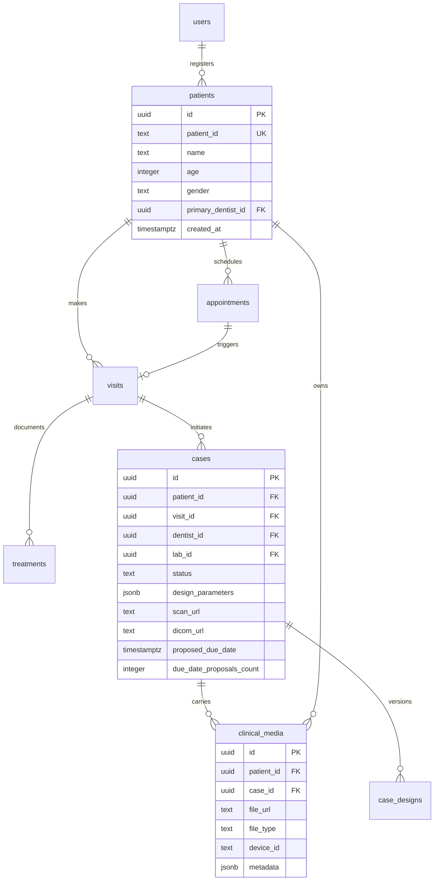

# DentalConnect OS (DCOS) / VishnoiOS — Comprehensive Master Vision & Production Roadmap

> **Document Status:** Active Unified Baseline & Production Roadmap  
> **Stakeholders:** Dr. Maneesh Vishnoi, Baleegh, and Core Engineering Partners  
> **Source Directory:** `.agent_memory/master_vision_and_production_roadmap.md`  
> **Cross-Reference:** `.agent_memory/feasibility_study_and_sprint_plan.md` & `VishnoiOS PRD`

---

## 1. Unified Architectural & Clinical Blueprint

This master roadmap synthesizes:
1. The **VishnoiOS PRD** (Hierarchical data model, Media Capture Hub, Local WebSocket Bridge, Mobile QR intake, DICOM multi-planar viewer, and Patient Portal).
2. The **Kanpur Clinical Baseline** (Demographic guardrails, 16 VITA Classical Shade Grid, 3-Zone Shading Canvas, FDI DentalDB Charting Grid, Implant workflows, Infinite Trials redos, and Proposed Due Date Acknowledgment).

```
+---------------------------------------------------------------------------------------------------+
|                                  UNIFIED VISHNOIOS / DCOS PHASES                                  |
+---------------------------------------------------------------------------------------------------+
                                                  |
       +--------------------+---------------------+---------------------+--------------------+
       |                    |                                           |                    |
       v                    v                                           v                    v
  [Phase 1]            [Phase 2]                                   [Phase 3]            [Phase 4]
 Database Hierarchy   Demographics, Shade & FDI                   Media Hub & Agent    Digital Tools & Portal
  - Patient/Visit/Case - Age & Gender checks                       - Source Picker UI   - 2D DICOM Slice Viewer
  - Clinical Media RLS - 16 VITA Shade Grid (A1-D4)                - Local WS Bridge    - Exocad Design Versions
  - Secure R2 Presign  - 3-Zone Shading (Cervical/Body/Incisal)    - Mobile QR Intake   - Patient Portal (/patient)
  - User/Profile unify - FDI Teeth (Red/Blue/Implant Overlay)      - Offline Queue Agent- 30-Day Storage Purge
```

---

## 2. Detailed Workable Development Phases

### Phase 1: Database Restructuring, Schema Hierarchy & RLS Hardening
*   **Objective:** Break the flat case table into a strict medical hierarchy (`patients` ➔ `appointments` ➔ `visits` ➔ `treatments` ➔ `cases` ➔ `clinical_media`).
*   **Key Deliverables:**
    1.  **Standardize Users:** Migrate all legacy `public.profiles` references to `public.users(id)` and remove redundant tables.
    2.  **Establish Entity Hierarchy:**
        *   `patients` (Unique Patient ID, Demographics, Primary Dentist)
        *   `appointments` (Scheduled/Completed status, Operatory Chair ID)
        *   `visits` (SOAP notes, Vitals, Visited timestamp)
        *   `treatments` (Clinical treatment plans, Prescriptions)
        *   `cases` (Laboratory link, FDI parameters, Status Kanban, Scan/Design URLs)
        *   `clinical_media` (Cloudflare R2 keys, Media types: IMAGE/STL/DICOM/PDF, Hardware Device ID)
    3.  **RLS Policies & Storage Security:** Row-level security for Dentists (own data) and Laboratories (assigned cases). Enforce presigned short-lived URLs for Cloudflare R2 files.

---

### Phase 2: Demographic Guardrails, Shade Canvas & FDI DentalDB Grid
*   **Objective:** Implement clinical precision guardrails and interactive restorative charting.
*   **Key Deliverables:**
    1.  **Patient Demographic Checks:**
        *   Mandatory Age & Biological Gender in Step 0 of Case Creation.
        *   Color-coded badges: **Blue Border** for Male, **Pink/Green Border** for Female.
    2.  **Implant Specifications:**
        *   Brand selection dropdown (Osstem, Dentium, Nobel Biocare, Straumann).
        *   Scan Body Model (Short vs Long).
        *   Analogs & Abutments logistics (`Doctor Provided` vs `Lab Provided`).
    3.  **Visual Shade Engine:**
        *   **16 VITA Classical Shade Grid:** Color-coded clickable hue swatches (A1–D4).
        *   **3-Zone Custom Shading Canvas:** Cervical (Gingival), Body (Middle), and Incisal (Tip) mapping.
        *   **Staining Checkmarks:** White spots, crack lines, incisal translucency.
        *   **Material Carousel:** Smooth sliding transition to Shade selection upon material click.
    4.  **FDI DentalDB Charting Grid:**
        *   Quadrant FDI notation (18–11, 21–28, 31–38, 41–48).
        *   Color coding: **Single Crowns in Red**, **Bridges in Blue** (Abutment in Dark Blue, Pontic in Light Blue), **Implants with Center-Hole Chimney Overlays**.
        *   Interactive parameters: Occlusal Clearance, Contact Tightness, and Pontic Shapes.

---

### Phase 3: Media Capture Hub & Local Capture Agent Bridge
*   **Objective:** Eliminate browser file picker friction with hardware connectivity and smartphone QR intakes.
*   **Key Deliverables:**
    1.  **Unified Media Capture Hub (`MediaCaptureHub`):**
        *   Single unified source picker: Operatory Intraoral Camera, Mobile QR Sync, DSLR Upload, STL/PLY Scanner Import, DICOM CBCT.
    2.  **Local Capture Agent (WebSocket Bridge):**
        *   Local background service running on `ws://127.0.0.1:12345`.
        *   Handshake and command protocol: `CAPTURE_REQUEST`, `CAMERA_STATUS`, `FRAME_DATA`, `CAPTURE_SUCCESS`.
        *   Offline local queue buffer that uploads to Cloudflare R2 upon reconnect.
    3.  **Mobile Phone (QR Code) Intake Flow:**
        *   Chairside QR generator in desktop browser session.
        *   Mobile browser capture route (`/upload/mobile-[token]`) allowing assistants to take shade photos and instantly push them into the live desktop case canvas via Supabase Realtime.

---

### Phase 4: Digital Dentistry Tools, Complex Workflows & Patient Portal
*   **Objective:** Advanced diagnostics, multi-step trial loops, automated retention, and patient access.
*   **Key Deliverables:**
    1.  **Cornerstone 2D DICOM Slice Viewer:** Multi-planar reconstruction viewer for CBCT/DICOM files in the Case Details screen.
    2.  **Exocad Design Version History:** `case_designs` revision audit table with technician upload logs and clinician `Approve`/`Request Revision` triggers.
    3.  **Infinite Trials Redo Loop:** Dynamic `[+ Request Trial]` stepper for complex full-arch zirconia cases, with final status confirmation (`Done`, `Repeat`, `Reject`).
    4.  **Proposed Due Date Acknowledgment:** Frozen baseline dentist due date, lab proposal dialog, and dentist `Confirm`/`Reject` audit log.
    5.  **30-Day Storage Purge & Case ZIP Export:** Automated retention policy for `.STL`/`.PLY` scans with one-click `[Export Patient Case History (ZIP)]`.
    6.  **Secure Patient Portal (`/patient`):** Token/OTP authenticated portal for patients to view appointment schedules, restoration warranties, and post-op care guides.

---

## 3. Data Flow & Security Model



---

## 4. Production Execution Standard

Every sprint deliverable must pass:
* **TypeScript Compilation:** Strict typing without `any` regressions.
* **Design Token Consistency:** 100% adherence to `bg-card`, `bg-background`, `text-primary`, `border-border` across Light (Warm Clinical) and Dark (Monokai) modes.
* **Component Isolation:** All tab panels and modals must enforce strict DOM isolation to prevent layout wrapping or side-by-side compression.
