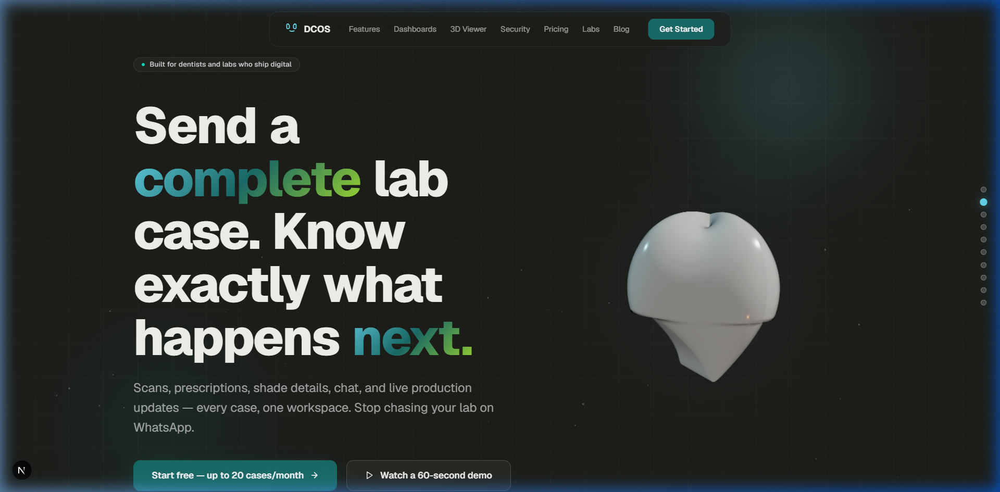
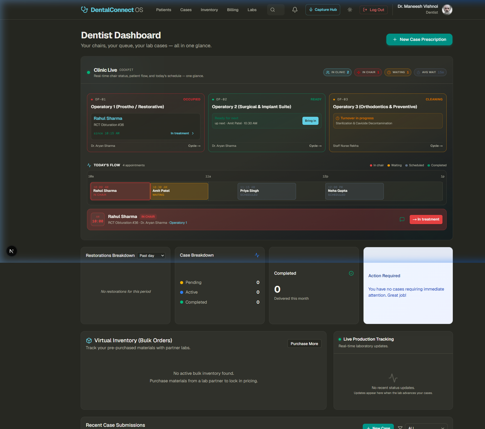
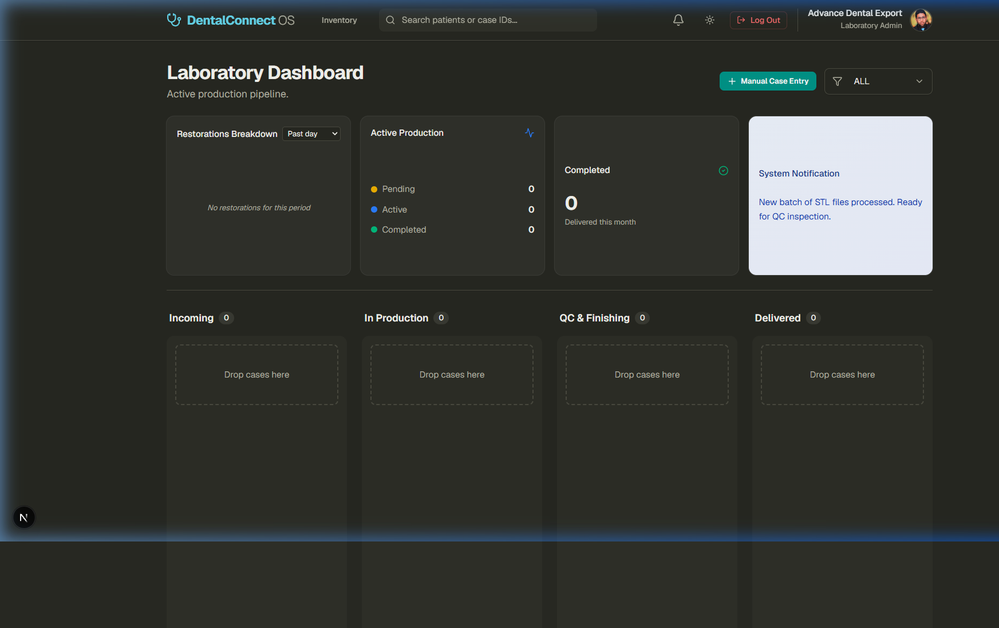
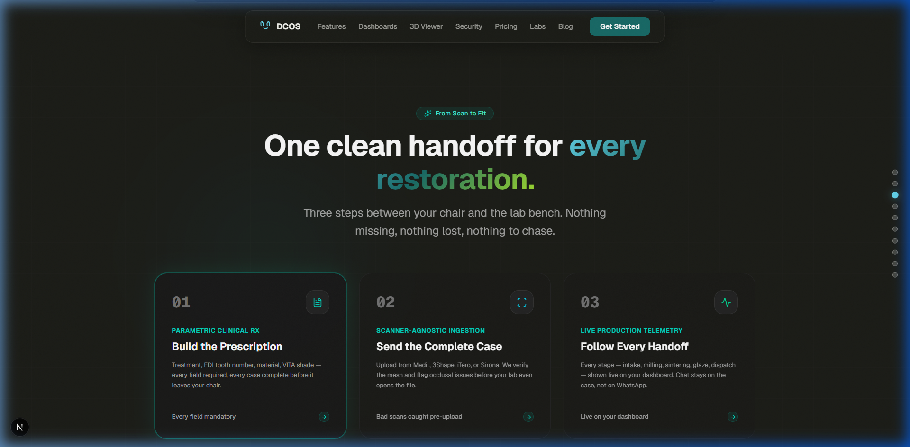
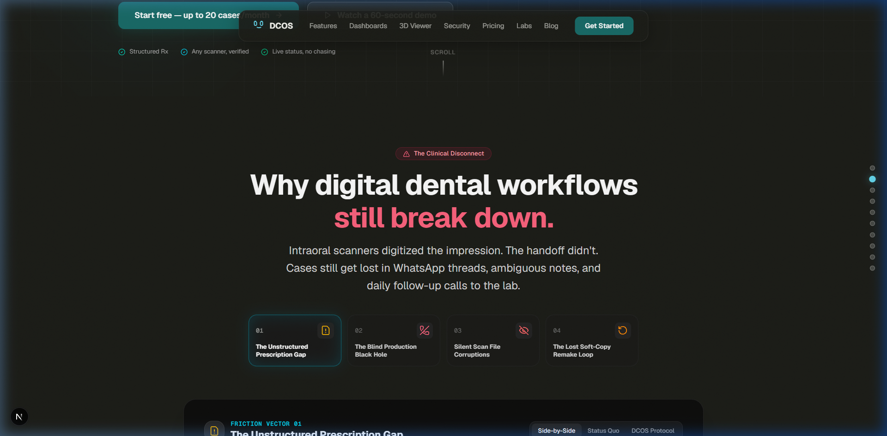
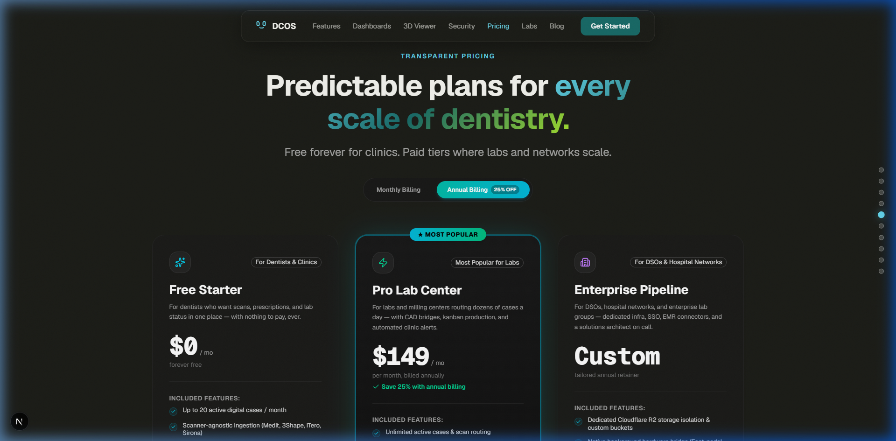
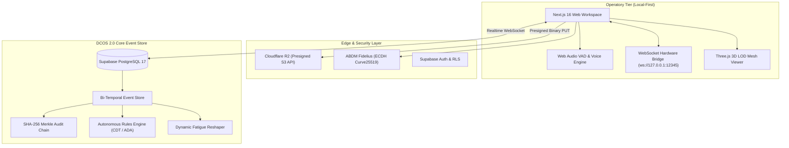

# DentalConnect OS (DCOS 2.0)
### The Bi-Temporal, Local-First, Ambient-Driven Clinical Operating System & Dental Lab Cloud

[](https://nextjs.org/)
[](https://turbo.build/pack)
[](https://supabase.com/)
[](https://threejs.org/)
[](https://hl7.org/fhir/)
[](https://abdm.gov.in/)
[-emerald?style=flat-square)](./scripts/verify-backend-master.ts)
[](https://www.typescriptlang.org/)

---



## 📌 Executive Overview

**DentalConnect OS (DCOS 2.0)** is an enterprise-grade clinical operating system and restorative supply-chain network. Built to eliminate the unstructured communication gap between chairside dental operatories and prosthetic milling centers, DCOS replaces lost WhatsApp messages, uncalibrated soft-copies, and silent scan errors with a **mathematically verifiable, bi-temporal, local-first platform**.

From **voice-dictated 6-point periodontal probing** to **autonomous AI insurance prior-authorization** and **progressive WebGL 3D STL/DICOM mesh inspection**, DCOS 2.0 digitizes the entire lifecycle of modern digital dentistry.

---

## ⚡ Core Capabilities & Platform Tour

### 1. Unified Clinic Live Cockpit & Operatory Control
The **Dentist Dashboard** consolidates chairside occupancy, live patient queues, consumable inventory levels, and lab production feeds into a single, high-density HUD.



- **Live Chairside Telemetry**: Real-time room status (`OP-01 Restorative`, `OP-02 Surgical Suite`, `OP-03 Ortho`).
- **Dynamic Queue Reshaper**: AI-adjusted appointment duration based on practitioner fatigue curves and procedural drift.
- **Odontogram & Perio Matrix**: Interactive FDI chart supporting 6-point probing depth tracking (disto-buccal, mid-buccal, mesio-buccal, disto-lingual, mid-lingual, mesio-lingual).

---

### 2. High-Throughput Laboratory Pipeline & Kanban
The **Laboratory Dashboard** provides prosthetic technicians with a drag-and-drop production pipeline synchronized via Supabase Realtime WebSockets with automatic material allocation.



- **Real-Time Kanban**: Instant state transitions across `Pending ➔ In Progress ➔ QC Hold ➔ Dispatched ➔ Delivered`.
- **Automatic Stock Sync**: Dragging a case into production automatically decrements physical inventory (e.g. Zirconia Multilayer discs, PMMA blanks).
- **In-App Per-Order Chat**: Structured direct line between technician and prescribing doctor with CAD/CAM attachments.

---

### 3. Sirona-Style 5-Tab Prescription & Case Handoff
DCOS enforces a strict 5-stage sequential clinical handoff pipeline modeled after premium CEREC closed-loop workflows.



```
[1. Administration] ──> [2. Acquisition] ──> [3. Model Mapping] ──> [4. CAD Specs] ──> [5. CAM Logistics]
```
- **16-Tile VITA Classical Shading**: 3-zone custom incisor canvas (Cervical, Body, Incisal) with characterization presets.
- **Client-Side Pre-Flight Check**: Real-time STL manifold verification, water-tight mesh evaluation, and prep margin detection before upload.
- **Cloudflare R2 Direct Uploads**: Direct presigned binary uploads bypass serverless payload limits with zero egress costs.

---

### 4. The Clinical Disconnect (Problem & Resolution Engine)
DCOS actively monitors and prevents the 4 primary friction vectors responsible for clinical remakes and scheduling bottlenecks.



| Friction Vector | Status Quo Failure | DCOS 2.0 Protocol Resolution |
| :--- | :--- | :--- |
| **Unstructured Prescription** | Scribbled lab slips & missing shade data | Structured 5-Tab Pipeline with mandatory "Not Specified" overrides |
| **Production Black Hole** | Zero status visibility after lab pickup | Real-time WebSocket timeline events & SMS/WhatsApp milestone alerts |
| **Silent Scan Corruption** | Non-manifold STL files detected hours later at CAM | Client-side WebGL pre-flight validator & mesh manifold analyzer |
| **Lost Remake Loop** | Complete rework on fit failure without history | Bi-temporal immutable Merkle ledger with full CAD revision history |

---

### 5. Multi-Tier Commercial Model
Tailored commercial tiers built for solo clinics, multi-operatory centers, high-volume dental milling centers, and multi-location hospital networks.



---

## 🏛️ Deep Architectural Foundations



### 1. Bi-Temporal Event Sourcing & Merkle Ledger
- **Two Time Dimensions**: Tracks *Valid Time* (when the clinical observation occurred) and *Transaction Time* (when the system committed the record).
- **Cryptographic Audit Chain**: Every aggregate event is linked via a SHA-256 Merkle hash chain anchored to `GENESIS_HASH`. Any historical tampering invalidates the mathematical proof.
- **Time-Travel Odontogram**: Reconstruct past tooth chart states at any exact second in history for clinical and legal audits.

### 2. ABDM Ecosystem & Fidelius Cryptographic Bridge
- **Milestone 1**: ABHA Number format validation (`91-XXXX-XXXX-XXXX`) and ABHA Address (`name@abdm`) resolution.
- **Milestone 2**: Automatic Care Context discovery (`ENC-XXXXXX`) mapped to FHIR R5 Patient resources.
- **Milestone 3**: End-to-end data encryption using **Fidelius (ECDH Curve25519 key exchange + AES-GCM-256)** for sovereign health record transit.

### 3. Ambient Voice & Hardware WebSocket Bridge
- **Speech VAD Engine**: Energy-based Voice Activity Detection filters out background suction and turbine drill noise.
- **Grammar Intent Decoder**: Deterministically translates spoken phrases (*"Tooth 36 mesial occlusal composite, 4 millimeters distal probing"*) into structured FHIR observation events.
- **Local Bridge (`ws://127.0.0.1:12345`)**: Zero-install hardware agent connects intraoral cameras, foot pedals, and DSLR tethering without browser permission barriers.

### 4. CAD/CAM 3D LOD Mesh Engine & Exocad Parser
- **4-Tier LOD Pyramid**: Generates coarse to full polygon resolution meshes, achieving **95% vertex reduction** for sub-80ms mobile viewport rendering.
- **Subgingival Margin Geometry**: 3D Catmull-Rom closed splines analyze margin perimeter and occlusal clearance tolerances in real-time.
- **Exocad `.constructionInfo` Parser**: Extracts restoration tooth mappings, cement gaps, margin points, and material parameters directly from CAD project XMLs.

---

## 📅 Development Timeline & Engineering Journey

The development of DentalConnect OS was executed as a rapid, rigorous sprint across five distinct engineering milestones:

```
┌────────────────────────────────────────────────────────────────────────────────────────┐
│                               DCOS DEVELOPMENT TIMELINE                                │
├──────────────┬───────────────────────────────┬─────────────────────────────────────────┤
│ Milestone    │ Timeframe                     │ Major Breakthroughs & Features          │
├──────────────┼───────────────────────────────┼─────────────────────────────────────────┤
│ Milestone 1  │ Late June 2026                │ Initial Prototype & Clinical Domain     │
│ Milestone 2  │ Early July 2026 (July 4–7)    │ Full-Stack Supabase & 5-Tab Pipeline    │
│ Milestone 3  │ Mid July 2026 (July 8–10)     │ VITA 16-Tile Shading & FDI DentalDB     │
│ Milestone 4  │ Mid-Late July 2026 (July 13)  │ Cloudflare R2 & Capture Agent Bridge    │
│ Milestone 5  │ August 2026 (DCOS 2.0)        │ Bi-Temporal Event Store & ABDM Suite    │
└──────────────┴───────────────────────────────┴─────────────────────────────────────────┘
```

### 🔹 Milestone 1: Initial Prototype & Concept Formation (Late June 2026)
- **Concept Validation**: Formulated the initial operational model bridging dental clinics and milling centers based on direct operatory workflow studies.
- **Frontend Prototype**: Built an interactive client-side application validating tooth selection grids and restorative status cycles.

### 🔹 Milestone 2: Next.js 16 & Full-Stack Supabase Architecture (July 4–7, 2026)
- **Full-Stack Architecture**: Migrated to Next.js App Router with Supabase PostgreSQL backend, row-level security (RLS), and real-time WebSocket subscriptions.
- **Sirona-Style 5-Tab Pipeline**: Replaced generic order forms with a 5-step structured pipeline (Administration ➔ Acquisition ➔ Model Mapping ➔ CAD ➔ CAM) enforcing mandatory "Not Specified" fallbacks.
- **Real-Time Notification Center**: Embedded Web Audio synth alerts and live production stepper updates.
- **UPI Intent Mobile Payments**: Implemented deep-linking (`upi://pay`) and dynamic QR invoicing for frictionless material pre-purchases.

### 🔹 Milestone 3: VITA Shading Canvas & FDI DentalDB Odontogram (July 8–10, 2026)
- **VITA 16-Tile Interactive Shading**: Created a 3-zone custom incisor canvas (Cervical, Body, Incisal) with characterizations and reference photo uploads.
- **DentalDB Quadrant Matrix**: Built an interactive FDI chart with exocad color codes (Red, Blue, Zinc), implant screw chimney overlays, and bridge connector lines.
- **Spatial 3D Pin System**: Built Three.js STL viewport with screen-space vector annotation pins.

### 🔹 Milestone 4: Cloudflare R2 Migration & Hardware Capture Bridge (July 13, 2026)
- **Cloudflare R2 Migration**: Migrated all heavy 3D scan and DICOM storage to Cloudflare R2 with presigned S3 PUT endpoints, eliminating data egress fees.
- **Capture Agent Architecture**: Formulated the local WebSocket companion service (`ws://127.0.0.1:12345`) for zero-permission intraoral camera capture and QR mobile intake.
- **Relational Schema Hierarchy**: Restructured database into an immutable entity model: `Patient ➔ Appointment ➔ Visit ➔ Treatment ➔ Case`.

### 🔹 Milestone 5: DCOS 2.0 Quantum Leap (August 2026)
- **Bi-Temporal Event Store**: Built domain event engine with valid-time/transaction-time dimensions and cryptographic SHA-256 Merkle chain verification.
- **ABDM Sovereign Health Gateway**: Integrated ABDM Milestones 1, 2, and 3 with Fidelius ECDH Curve25519 + AES-GCM-256 encryption and FHIR R5 compliance.
- **Ambient Voice Dictation**: Engineered speech VAD and grammar parser mapping spoken dictations directly into 6-point perio charting events.
- **Progressive 3D LOD & Exocad Bridge**: Built 4-tier progressive LOD decimation and native `.constructionInfo` CAD XML parser.
- **Autonomous Prior-Auth & Dynamic Scheduler**: Integrated CDT insurance rules adjudication and fatigue-aware queue duration calculation.
- **Master Verification**: Achieved **100% test passage across 33/33 master backend checks**.

---

## 📂 Repository Directory Structure

```
.
├── agent_memory/                  # Persistent strategic memory & Obsidian knowledge graph
│   ├── architecture/              # Technical specifications & blueprints
│   ├── state/                     # Active session handoffs, changelog & sprint tasks
│   └── vision/                    # Commercial feasibility studies & roadmaps
├── docs/                          # Architecture documentation & design assets
│   ├── images/                    # Platform screenshots & UI assets
│   ├── codebase_audit.md          # Security and codebase audit reports
│   └── design.md                  # Monokai dark & glassmorphic design token system
├── public/                        # Static assets, 3D demonstration models & icons
├── scripts/                       # Comprehensive verification & test runners
│   ├── verify-backend-master.ts   # Master 33/33 test suite (Phases 1–4)
│   ├── verify-phase1.ts           # Storage & intake token validation
│   ├── verify-phase2.ts           # Bi-temporal event store, Merkle chain & ABDM suite
│   ├── verify-phase3.ts           # Voice VAD, grammar parser & capture bridge
│   └── verify-phase4.ts           # Progressive 3D LOD, Exocad XML & prior-auth
├── src/
│   ├── app/                       # Next.js App Router (Dashboard, Landing, Cases, Billing)
│   ├── components/
│   │   ├── billing/               # Clinical invoices, ledger & payment links
│   │   ├── cases/                 # Case detail views, timeline feeds & chats
│   │   ├── dashboards/            # Dentist Live Cockpit & Lab Kanban Board
│   │   ├── dental/                # 32-tooth FDI odontogram & 6-point perio matrix
│   │   ├── inventory/             # Virtual credits & consumable stock manager
│   │   ├── landing/               # Obsidian glassmorphic marketing portal
│   │   └── viewer/                # Three.js 3D STL & 4-tier DICOM MPR slice viewer
│   ├── lib/
│   │   ├── abdm/                  # FHIR R5 schemas, ABHA verification & Fidelius crypto
│   │   ├── auth/                  # Local storage tokens & transient keys
│   │   ├── cad/                   # Exocad XML extraction & Catmull-Rom margin splines
│   │   ├── events/                # Bi-temporal aggregate store & SHA-256 Merkle chain
│   │   ├── hardware/              # WebSocket capture agent bridge & camera protocol
│   │   ├── insurance/             # Autonomous CDT prior-authorization rules engine
│   │   ├── lod/                   # Progressive 3D LOD pyramid & mesh decimation
│   │   ├── r2.ts                  # Cloudflare R2 presigned URL helpers
│   │   ├── scheduling/            # Dynamic fatigue-adjusted queue reshaper
│   │   ├── supabase/              # Supabase SSR client & middleware
│   │   └── voice/                 # Speech VAD & clinical dental grammar decoder
│   ├── mockData.ts                # Mock dataset & seed users
│   └── types.ts                   # Universal TypeScript interface definitions
├── supabase/                      # Database migrations, seed data & SQL triggers
└── package.json                   # Dependencies, build scripts & metadata
```

---

## 🛠️ Technology Stack Matrix

| Layer | Technologies Used |
| :--- | :--- |
| **Frontend Framework** | Next.js 16.2 (Turbopack, App Router, React 19 Server Components) |
| **Design & Styling** | Tailwind CSS v4, Glassmorphism, CSS 3D Transforms, Monokai Dark HUD |
| **Database & Auth** | Supabase (PostgreSQL 17), Row-Level Security (RLS), Realtime WebSockets |
| **Object Storage** | Cloudflare R2 (S3-Compatible, Presigned Uploads, Zero Egress) |
| **3D Rendering** | Three.js, React Three Fiber (R3F), Drei, Progressive LOD Mesh Engine |
| **Medical Standards** | HL7 FHIR R5, DICOM MPR (Multi-Planar Reconstruction), FDI 2-Digit Charting |
| **Sovereign Health** | ABDM (Ayushman Bharat Digital Mission) M1, M2 & M3, Fidelius Encryption |
| **Hardware & Ambient** | WebSockets (`ws://127.0.0.1:12345`), Web Audio API VAD, Grammar Decoders |
| **Testing & Audit** | TypeScript Strict (`npx tsx`), SHA-256 Merkle Ledger, Node Native Crypto |

---

## 🚀 Getting Started & Local Development

### 1. Prerequisites
- **Node.js**: `v20.x` or higher
- **npm** or **pnpm**
- **Git**

### 2. Clone and Install Dependencies
```bash
git clone https://github.com/DCOSArch/DCOS.git
cd DCOS
npm install
```

### 3. Environment Configuration
Create a `.env.local` file in the root directory:
```env
NEXT_PUBLIC_SUPABASE_URL=https://your-project.supabase.co
NEXT_PUBLIC_SUPABASE_ANON_KEY=your-anon-key
SUPABASE_SERVICE_ROLE_KEY=your-service-role-key
CLOUDFLARE_R2_BUCKET=dcos-scans
CLOUDFLARE_R2_PUBLIC_URL=https://r2.yourdomain.com
```

### 4. Run Development Server
```bash
npm run dev
```
Open [http://localhost:3000](http://localhost:3000) to view the live platform. Quick demo credentials are built into the login portal at [http://localhost:3000/login](http://localhost:3000/login).

### 5. Execute Backend Master Verification Suite
Run the 33-step master test harness validating all 4 architectural tiers:
```bash
npm run test:backend
# or
npx tsx scripts/verify-backend-master.ts
```

Output:
```
================================================================================
🛡️  DCOS 2.0 COMPREHENSIVE MASTER BACKEND ARCHITECTURAL AUDIT (PHASES 1–4)
================================================================================
...
================================================================================
🏁 MASTER AUDIT COMPLETE: 33/33 TESTS PASSED (100% SUCCESS)
================================================================================
🏆 ALL 4 PHASES VERIFIED SOLID WITH ZERO LAPSES IN BACKEND INTEGRITY.
```

---

## 🔒 Security, Compliance & Data Isolation
- **Row-Level Security (RLS)**: Strict database tenant isolation prevents cross-clinic or cross-lab visibility.
- **HIPAA-Compliant Patient Hashing**: Patient identifiers are cryptographically hashed for public 3D previews.
- **ABDM Fidelius Security**: Encrypted with Curve25519 key pairs and ephemeral AES-GCM session keys.
- **Ephemeral Transient Tokens**: Intraoral hardware capture and mobile uploads use single-use tokens that expire within minutes.

---

## 📄 License & Enterprise Partnership

DentalConnect OS is developed under a dual **Open-Core & Commercial Enterprise License**.

- **Open Core**: Available for individual practitioners and standalone laboratories.
- **Enterprise Retainer**: Multi-location hospital chains, national milling centers, and commercial white-label deployments include dedicated Cloudflare R2 isolation, hardware agent bridges, ABDM M1–M3 gateways, and custom SLAs.

*Maintained by the DentalConnect OS Architecture Team.*
