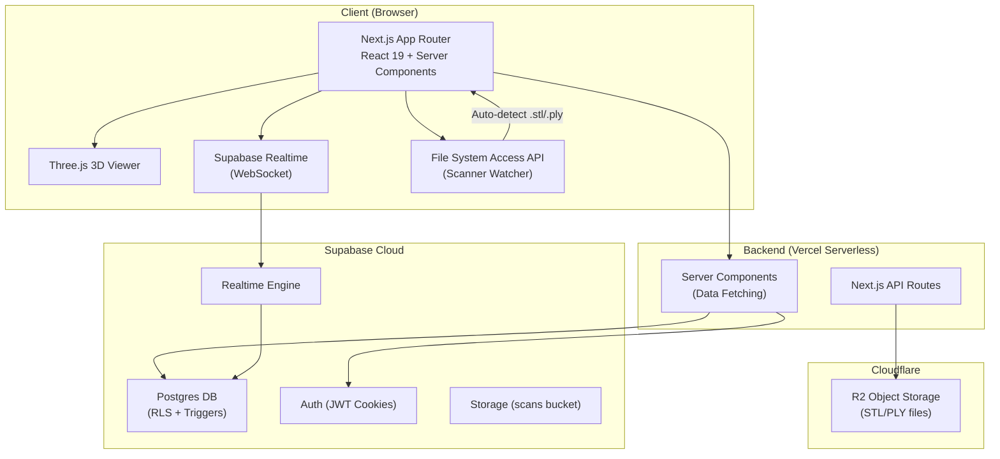
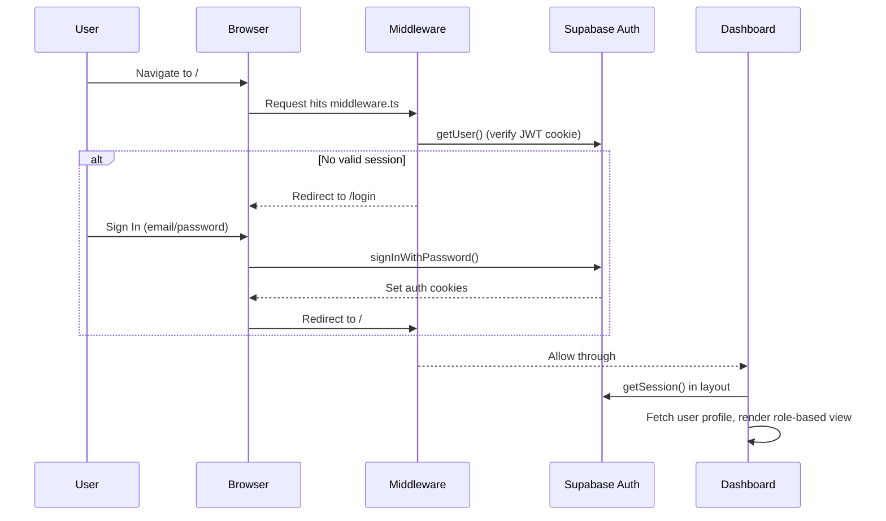
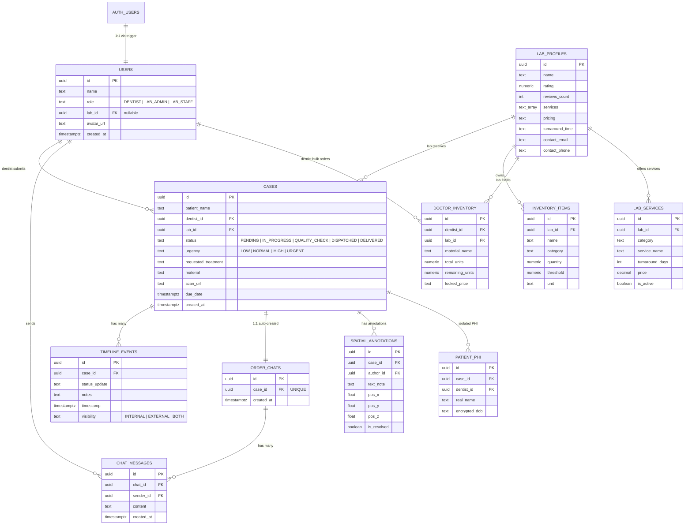

> ⚠️ **Duplicate content flag:** this file is near-identical to [[product_analysis]] (`docs/product_analysis.md`) — same title, same generated date (July 4, 2026), same 14-section structure. Left both in place since deleting either is your call, not mine — see the vault reorg summary for details.

# DentalConnect OS — Complete Product Analysis

> **Document generated:** July 4, 2026
> **Codebase name:** `DCOSArch/DCOS`
> **Repository root:** `c:\Users\bentn\OneDrive\Desktop\DEs`

---

## 1. Executive Summary

**DentalConnect OS** is a B2B SaaS platform prototype that serves as an "operating system" for modern dentistry. It connects **Dentists/Clinics** and **Dental Laboratories** on a single, real-time platform to streamline the full lifecycle of prosthetic and restorative dental case management — from digital scan upload, through fabrication tracking, to final delivery.

The product is built with **Next.js 16** (App Router), **Supabase** (Postgres + Auth + Realtime + Storage), and **Cloudflare R2** for large 3D scan file hosting. It features role-based dashboards, a drag-and-drop Kanban production pipeline, embedded Three.js 3D model viewing with spatial annotations, real-time order chat, bulk inventory management, and a patient-facing "Smile Preview" link (B2B2C pathway).

---

## 2. Product Vision & Market Position

### 2.1 The Problem

The dental laboratory workflow is still largely manual and fragmented:
- Dentists ship physical impressions or email STL files to labs with no structured tracking.
- Labs manage production on whiteboards or spreadsheets with no visibility for the prescribing dentist.
- Communication happens over untracked WhatsApp/email threads.
- Inventory is tracked in silos; there is no link between material usage and case production.
- Patients have zero visibility into the design of their restorations before fitting.

### 2.2 The Solution

DentalConnect OS acts as a **shared digital workspace** between dental clinics and laboratories:

| Stakeholder | Value Proposition |
|---|---|
| **Dentists** | Submit digital prescriptions (Rx), upload 3D scans, track case status in real-time, manage pre-purchased material inventory, share design previews with patients. |
| **Laboratories** | Receive structured digital orders, manage production via a Kanban board, auto-sync inventory with case production, communicate with dentists via contextual per-order chat. |
| **Patients** | View a HIPAA-compliant, read-only 3D preview of their proposed smile design via a shareable link (B2B2C). |

### 2.3 Core Differentiators

1. **Dual-Layer Timeline** — Labs see internal production notes (e.g., "Milling Started"); Dentists see only externally-visible updates. Both see "BOTH"-visibility events.
2. **Spatial 3D Annotations** — Users can drop annotation pins directly on the 3D STL model with notes (e.g., "Margin unclear here"), resolvable by the lab.
3. **Automated Inventory Sync** — When a Kanban card moves from "Incoming" to "In Production", material is auto-deducted via database triggers.
4. **B2B2C Smile Preview** — Dentists generate a time-limited, unauthenticated link for patients to view a 3D model of their prosthetic — no login required, no PHI exposed.
5. **Zero-Click Scanner Integration** — A `ScannerFolderWatcher` class uses the browser File System Access API to auto-detect new STL exports from local scanners.

---

## 3. Technology Stack

| Layer | Technology | Notes |
|---|---|---|
| **Framework** | Next.js 16.2.9 (App Router) | Server Components, Server Actions, React 19 |
| **Language** | TypeScript 5 | Strict typing via `src/types.ts` |
| **Styling** | Tailwind CSS v4 | `@tailwindcss/postcss`, `@theme inline` tokens |
| **UI Components** | Radix UI + shadcn/ui | 13 components: Button, Card, Dialog, Select, Table, Badge, Avatar, etc. |
| **3D Rendering** | Three.js 0.184 + React Three Fiber 9 + Drei 10 | STL loading, orbit controls, HTML annotation overlays |
| **Charts** | Recharts 3.8 | Donut chart for case breakdown |
| **Icons** | Lucide React | Consistent icon system |
| **Auth** | Supabase Auth (`@supabase/ssr` 0.12) | Cookie-based SSR auth with middleware session refresh |
| **Database** | Supabase Postgres | 10+ tables, Row Level Security (RLS), triggers, functions |
| **Realtime** | Supabase Realtime (Postgres Changes) | Live updates for cases, chat messages, timeline events |
| **Storage (Scans)** | Supabase Storage (`scans` bucket) + Cloudflare R2 (planned) | Dual storage strategy; presigned URLs via AWS SDK |
| **Deployment** | Vercel | `vercel.json` with Next.js framework config |
| **Fonts** | Geist Sans / Geist Mono (Google Fonts) | Variable fonts via `next/font/google` |

---

## 4. Architecture Overview

### 4.1 High-Level Architecture



### 4.2 Authentication Flow



### 4.3 Directory Structure

```
DEs/
├── src/
│   ├── app/
│   │   ├── layout.tsx                    # Root layout (fonts, metadata)
│   │   ├── globals.css                   # Tailwind v4 imports + theme tokens
│   │   ├── login/page.tsx                # Auth page (Sign In / Sign Up)
│   │   ├── preview/[hash]/page.tsx       # B2B2C patient preview (unauthenticated)
│   │   ├── labs/page.tsx                 # Legacy labs route
│   │   ├── api/upload/route.ts           # Cloudflare R2 presigned URL endpoint
│   │   └── (dashboard)/                  # Protected route group
│   │       ├── layout.tsx                # Auth guard + Navbar injection
│   │       ├── page.tsx                  # Role-based dashboard router
│   │       ├── cases/[id]/page.tsx       # Case detail server component
│   │       ├── inventory/page.tsx        # Lab inventory management
│   │       └── lab-directory/page.tsx    # Dentist-facing lab discovery
│   ├── components/
│   │   ├── Navbar.tsx                    # Global nav with search, notifications, auth
│   │   ├── StatusBadge.tsx               # Color-coded case status badges
│   │   ├── SummaryChart.tsx              # Recharts pie chart (cases breakdown)
│   │   ├── ThreeDViewer.tsx              # Three.js STL viewer with annotations
│   │   ├── dashboards/
│   │   │   ├── DentistDashboard.tsx      # Dentist home (cases table, inventory cards)
│   │   │   └── LabDashboard.tsx          # Lab home (Kanban board)
│   │   ├── views/
│   │   │   └── CaseDetailsClient.tsx     # Case detail view (3D, timeline, chat)
│   │   └── ui/                           # 13 shadcn/ui primitive components
│   ├── lib/
│   │   ├── services.ts                   # Lab services (Rx catalog) fetcher
│   │   ├── utils.ts                      # cn() Tailwind merge utility
│   │   ├── supabase/
│   │   │   ├── client.ts                 # Browser Supabase client
│   │   │   ├── server.ts                 # Server Supabase client (cookies)
│   │   │   └── middleware.ts             # Session refresh + route protection
│   │   └── utils/
│   │       ├── stlValidator.ts           # Client-side STL geometry validation
│   │       └── folderWatcher.ts          # File System Access API scanner watcher
│   ├── types.ts                          # TypeScript interfaces (8 types)
│   ├── mockData.ts                       # Seed/mock data for development
│   └── proxy.ts                          # Proxy utility
├── supabase/
│   ├── config.toml                       # Supabase local dev config
│   ├── seed.sql                          # Development seed data
│   └── migrations/                       # 10 SQL migration files
│       ├── 20260618120808_init_schema.sql
│       ├── 20260618131640_add_scans_bucket.sql
│       ├── 20260621000000_add_bulk_inventory_and_chat.sql
│       ├── 20260621000001_auth_and_triggers.sql
│       ├── 20260621000002_insert_policies.sql
│       ├── 20260621000003_storage_and_scan_url.sql
│       ├── 20260621000004_enable_realtime.sql
│       ├── 20260622_phase1_core.sql
│       ├── 20260622_phase2_workflows.sql
│       └── 20260622_phase3_wealth.sql
├── package.json
├── next.config.ts
├── tsconfig.json
├── vercel.json
└── .env.example / .env.local
```

---

## 5. Data Model (Database Schema)

### 5.1 Entity Relationship Diagram



### 5.2 Database Triggers & Automation

The system uses **three key Postgres triggers** for automation:

| Trigger | Event | Action |
|---|---|---|
| `on_auth_user_created` | `AFTER INSERT ON auth.users` | Auto-creates a `public.users` profile from signup metadata. If `LAB_ADMIN`, also creates a `lab_profiles` row. |
| `on_case_created_create_chat` | `AFTER INSERT ON public.cases` | Auto-creates an `order_chats` row for every new case, enabling the per-order chat channel. |
| `trigger_deduct_inventory` | `AFTER INSERT ON public.cases` | Auto-deducts 1 unit from `doctor_inventory` matching `dentist_id`, `lab_id`, and `material`. |

### 5.3 Row Level Security (RLS)

RLS is enabled on **all tables**. Key policies:

- **Cases:** Dentists see only their own; Labs see cases assigned to them.
- **Timeline Events:** Dentists see `EXTERNAL` + `BOTH`; Labs see `INTERNAL` + `EXTERNAL` + `BOTH`.
- **Inventory:** Labs see only their own inventory.
- **Doctor Inventory:** Dentists see their allocations; Labs see allocations to them.
- **Chat:** Only participants in the linked case can access the chat.
- **Patient PHI:** *Only* the prescribing dentist can read/write PHI — labs never see patient real names (planned).
- **Lab Profiles:** Publicly readable for the directory.

### 5.4 Realtime Subscriptions

Tables published via `supabase_realtime`:
- `chat_messages` — live message delivery
- `timeline_events` — live timeline updates
- `cases` — live Kanban card movement (subscribed per-dashboard)

---

## 6. Feature Breakdown

### 6.1 Authentication & Onboarding

**File:** [login/page.tsx](file:///c:/Users/bentn/OneDrive/Desktop/DEs/src/app/login/page.tsx)

- Email/password authentication via Supabase Auth.
- Unified Sign-In / Sign-Up form with toggle.
- During Sign-Up, users select their **role** (`DENTIST` or `LAB_ADMIN`).
- `LAB_ADMIN` users also provide a **Lab Name**, which auto-creates a `lab_profiles` row via the `handle_new_user` trigger.
- Auth middleware ([middleware.ts](file:///c:/Users/bentn/OneDrive/Desktop/DEs/src/lib/supabase/middleware.ts)) protects all routes except `/login`, `/auth`, and `/preview`.

---

### 6.2 Role-Based Dashboard Routing

**File:** [page.tsx (dashboard root)](file:///c:/Users/bentn/OneDrive/Desktop/DEs/src/app/(dashboard)/page.tsx)

The dashboard root is a **server component** that:
1. Fetches the authenticated user's profile.
2. Checks `userProfile.role`.
3. Renders `<DentistDashboard>` or `<LabDashboard>` accordingly.
4. Passes server-fetched data (cases, inventory, lab profiles) as initial props.

---

### 6.3 Dentist Dashboard

**File:** [DentistDashboard.tsx](file:///c:/Users/bentn/OneDrive/Desktop/DEs/src/components/dashboards/DentistDashboard.tsx) (509 lines)

#### Summary Cards
- **Cases Breakdown** — Recharts donut chart showing Pending / Active / Completed distribution.
- **Active Cases** — Count of non-delivered cases.
- **Completed** — Count of delivered cases this month.
- **Action Required** — Notification card for cases needing dentist attention.

#### Virtual Inventory Panel
- Displays `doctor_inventory` items (bulk-purchased materials from labs).
- Each card shows material name, partner lab, locked price per unit, and a progress bar of remaining vs. total units.
- Color-coded: green > 50%, amber 20-50%, red < 20%.

#### Cases Table
- Filterable by status (`ALL`, `PENDING`, `IN_PROGRESS`, `QUALITY_CHECK`, `DISPATCHED`, `DELIVERED`).
- Each row shows Case ID (mono), Patient, Treatment, Due Date, Status badge, Urgency indicator.
- "View" button navigates to `/cases/[id]`.

#### Create New Case (FAB + Dialog)
- Floating Action Button (bottom-right) opens a modal.
- Fields: Patient Name, Assign to Laboratory (dropdown from `lab_profiles`), Treatment Type, Urgency, STL/PLY file upload.
- File upload flow:
  1. User selects `.stl` or `.ply` file.
  2. File is uploaded to Supabase Storage `scans` bucket.
  3. Case row is inserted into `cases` table with `scan_url`.
  4. Triggers fire: chat is auto-created, inventory is auto-deducted.
- Upload states: `idle` → `analyzing` (animated progress) → success/error.
- Pre-flight warning state available for scan validation results.

#### Realtime
- Subscribes to `postgres_changes` on `cases` table filtered by `dentist_id`.
- Calls `router.refresh()` on any change to trigger server-side re-fetch.

---

### 6.4 Laboratory Dashboard (Kanban Board)

**File:** [LabDashboard.tsx](file:///c:/Users/bentn/OneDrive/Desktop/DEs/src/components/dashboards/LabDashboard.tsx) (305 lines)

#### Kanban Board
Four columns representing the production pipeline:

| Column | Status | Description |
|---|---|---|
| **Incoming** | `PENDING` | Newly received case prescriptions |
| **In Production** | `IN_PROGRESS` | Cases being fabricated |
| **QC & Finishing** | `QUALITY_CHECK` | Quality control inspection |
| **Dispatched** | `DISPATCHED` | Shipped to the dentist |

- Cards are **drag-and-drop** between columns using native HTML5 Drag & Drop API.
- Each card shows: Case ID, Patient Name, Treatment, Referring Dentist, Due Date, Status Badge, Urgency indicator.
- Clicking a card navigates to `/cases/[id]`.

#### Material Sync on Drag
When a card is dragged from `PENDING` → `IN_PROGRESS`:
- The system matches `caseItem.material` against `inventory` items.
- If a match is found with `quantity > 0`, it deducts 1 unit optimistically.
- A green toast notification appears: "Deducted 1 [unit] of [material]".
- The status is persisted to Supabase via `cases.update()`.

#### Summary Cards
- Same donut chart + Active/Completed counters as Dentist view.
- System Notification card (e.g., "New batch of STL files processed").

#### Urgency Filter
- Filter the Kanban by urgency level (ALL / LOW / NORMAL / HIGH / URGENT).

---

### 6.5 Case Details View

**File:** [CaseDetailsClient.tsx](file:///c:/Users/bentn/OneDrive/Desktop/DEs/src/components/views/CaseDetailsClient.tsx) (408 lines)

A rich, two-column detail view:

#### Left Column (2/3 width)
1. **Prescription Details Card** — Treatment, Due Date, Prescribing Dentist, Destination Lab.
2. **3D Design Viewer** — Full Three.js STL renderer with annotation system (see §6.7).
3. "Download STL" button (UI placeholder).

#### Right Column (1/3 width)
1. **Case Timeline** — Chronological event feed with:
   - Role-based filtering: Dentists see `EXTERNAL` + `BOTH`; Labs see `INTERNAL` + `BOTH`.
   - Internal events are tagged with an amber "Internal" badge.
   - Real-time subscription adds new timeline events as they arrive.
2. **Order Chat** (see §6.6).

#### Header Actions
- **Dentist:** "Generate Patient Link" button → opens modal with a shareable URL (`https://dentalconnect.os/preview/hash-CASEID`), copy-to-clipboard, 72-hour expiry notice.
- **Lab Admin:** "Update Status" dropdown → changes case status + pushes a timeline event + persists to Supabase.

---

### 6.6 Order Chat (Real-Time Messaging)

**Implementation:** Embedded within [CaseDetailsClient.tsx](file:///c:/Users/bentn/OneDrive/Desktop/DEs/src/components/views/CaseDetailsClient.tsx#L318-L376)

- **Locked by default** — Chat is disabled when case status is `PENDING` or `REJECTED`. A padlock icon with "Chat Locked" message is shown.
- **Unlocks automatically** once the lab moves the case to `IN_PROGRESS` or beyond.
- Messages are fetched from `chat_messages` table via the `order_chats` junction.
- **Real-time delivery** via Supabase channel subscription filtered by `chat_id`.
- Bubble-style UI: sender messages right-aligned (primary color), received left-aligned (muted).
- Timestamps shown as "2-digit hour:minute".

---

### 6.7 3D Viewer & Spatial Annotations

**File:** [ThreeDViewer.tsx](file:///c:/Users/bentn/OneDrive/Desktop/DEs/src/components/ThreeDViewer.tsx) (199 lines)

Built on React Three Fiber + Drei:

- **STL Loading:** Uses `STLLoader` from Three.js to parse binary/ASCII STL files.
- **Material:** Off-white/bone color (`#e6e1d6`), `roughness: 0.4`, `metalness: 0.1`, double-sided.
- **Environment:** Lit using Drei `<Stage>` with "city" environment map.
- **Controls:** `<OrbitControls>` with damping. Disabled during annotation mode to prevent drag interference.
- **Annotation System:**
  - "Drop Annotation Pin" button toggles annotation mode.
  - Clicking the mesh captures the 3D point and face normal.
  - An inline text input appears at the click position (Drei `<Html>`).
  - Saved annotations render as bouncing red `<MapPin>` icons with text cards.
  - Each annotation has a "Resolve" button (marks `isResolved: true`).
  - Resolved annotations are hidden.
- **Read-only mode** for patient preview (no annotation UI).
- **Loading state:** Spinning ring animation while STL is loading.

---

### 6.8 Lab Directory

**File:** [lab-directory/page.tsx](file:///c:/Users/bentn/OneDrive/Desktop/DEs/src/app/(dashboard)/lab-directory/page.tsx) (259 lines)

Available to **Dentists** (nav link: "Lab Directory"):

- Grid of lab profile cards fetched from `lab_profiles` table.
- Each card shows: Lab Name, Star Rating (with review count), Services (badge chips), Turnaround Time, Pricing Tier.
- **Search:** Filter by lab name or service keyword.
- **Add Lab:** Opens a modal to insert a new `lab_profiles` row.
- **View Full Profile:** Modal showing contact info (email, phone), detailed services, pricing, turnaround.
- **"Secure Chat Unlocks After Order"** — An amber notice on every card indicating chat is order-gated.

---

### 6.9 Inventory Management

**File:** [inventory/page.tsx](file:///c:/Users/bentn/OneDrive/Desktop/DEs/src/app/(dashboard)/inventory/page.tsx) (189 lines)

Available to **Lab Admins** (nav link: "Inventory"):

- **Low Stock Alerts** — Red alert cards for items below their threshold. Each has an "Order Now" button.
- **Current Stock Table** — Item Name, Category, Quantity (with unit), Status Badge (In Stock / Reorder Needed), Order action.
- **Partner Clinic Allocations** — Table showing `doctor_inventory` allocations: Material Name, Remaining/Total, Locked Price per unit.
- Server component with direct Supabase queries (no client-side state).
- Access restricted to `LAB_ADMIN` role (redirects others to `/`).

---

### 6.10 B2B2C Patient Preview

**File:** [preview/[hash]/page.tsx](file:///c:/Users/bentn/OneDrive/Desktop/DEs/src/app/preview/[hash]/page.tsx) (65 lines)

- **Public route** — Excluded from auth middleware.
- URL format: `/preview/hash-{CASE_UUID}`
- Server component fetches only `scan_url` and `lab_id.name` from the case — **no patient name** is exposed (HIPAA design).
- Renders `<ThreeDViewer>` in `isReadOnly` mode (no annotation controls).
- "HIPAA Compliant Viewer" badge displayed.
- Footer prompts patient to "contact your dental provider to approve this design."

---

### 6.11 Pre-Flight Scan Validation (Utility)

**File:** [stlValidator.ts](file:///c:/Users/bentn/OneDrive/Desktop/DEs/src/lib/utils/stlValidator.ts) (102 lines)

Client-side STL geometry validation using Three.js:

- Parses the STL `ArrayBuffer` using `STLLoader`.
- Computes `boundingBox` dimensions (X, Y, Z).
- Applies heuristic checks:
  - **Too small:** All dimensions < 1mm → "Did you export with incorrect units?"
  - **Too large:** Any dimension > 200mm → "Please verify scale."
  - **Thin geometry:** Min dimension < 1mm → "May result in fragile restoration or milling failure."
- Returns `{ isValid, warnings[], dimensions }`.

> [!NOTE]
> This validator is implemented but **not yet wired** into the "Create Case" upload flow. The `DentistDashboard` has an `uploadState: 'warning'` state with a hardcoded occlusal clearance warning, suggesting planned integration.

---

### 6.12 Scanner Folder Watcher (Utility)

**File:** [folderWatcher.ts](file:///c:/Users/bentn/OneDrive/Desktop/DEs/src/lib/utils/folderWatcher.ts) (114 lines)

Zero-click scanner integration using the browser **File System Access API**:

- `requestDirectoryAccess()` — Prompts user to select their scanner export folder (e.g., `C:/Scans`).
- `startWatching(intervalMs)` — Polls the directory at the configured interval (default 2s).
- When a new `.stl` or `.ply` file appears (not in the `knownFiles` set), fires `onNewFileCallback(file)`.
- Intended use: Automatically open the "Create Case" modal when the scanner exports a new file.

> [!NOTE]
> This utility is **implemented but not integrated** into any UI component. It's ready for a "Watch Scanner Folder" button in the Dentist Dashboard.

---

### 6.13 Upload API (Cloudflare R2)

**File:** [api/upload/route.ts](file:///c:/Users/bentn/OneDrive/Desktop/DEs/src/app/api/upload/route.ts) (51 lines)

Server-side API route for generating **presigned PUT URLs** to Cloudflare R2:

- Authenticates the request via Supabase SSR (`getUser()`).
- Accepts `{ filename, contentType }` in the request body.
- Generates a unique key: `{userId}/{timestamp}_{sanitized_filename}`.
- Returns a presigned URL valid for 1 hour.
- Requires env vars: `CLOUDFLARE_ACCOUNT_ID`, `R2_ACCESS_KEY_ID`, `R2_SECRET_ACCESS_KEY`, `R2_BUCKET_NAME`.

> [!IMPORTANT]
> The current `DentistDashboard` uploads directly to **Supabase Storage** (`scans` bucket), not R2. This API route is built but represents a **planned migration** to Cloudflare R2 for production-scale scan hosting.

---

### 6.14 Navbar & Global Navigation

**File:** [Navbar.tsx](file:///c:/Users/bentn/OneDrive/Desktop/DEs/src/components/Navbar.tsx) (192 lines)

- **Brand:** Stethoscope icon + "DentalConnect OS" text.
- **Role-Based Nav Links:**
  - Dentist: "Lab Directory" → `/lab-directory`
  - Lab Admin: "Inventory" → `/inventory`
- **Global Search:** Search patients or case IDs across all cases. Results dropdown shows patient name, case ID, and status badge. Clicking navigates to `/cases/[id]`.
- **Notifications:** Dropdown showing recent cases with `DELIVERED` or `QUALITY_CHECK` status updates (top 3).
- **Dark Mode Toggle:** Toggles `dark` class on `<html>` element.
- **Logout:** Signs out via `supabase.auth.signOut()` and redirects to `/login`.
- **User Info:** Name, role label, avatar (from `pravatar.cc`).

---

## 7. TypeScript Type System

**File:** [types.ts](file:///c:/Users/bentn/OneDrive/Desktop/DEs/src/types.ts) (80 lines)

Eight core types define the domain model:

| Type | Purpose | Key Fields |
|---|---|---|
| `Role` | Union type | `'DENTIST' \| 'LAB_ADMIN' \| 'LAB_STAFF'` |
| `CaseStatus` | Case lifecycle states | `'PENDING' \| 'IN_PROGRESS' \| 'QUALITY_CHECK' \| 'DISPATCHED' \| 'DELIVERED'` |
| `Urgency` | Priority levels | `'LOW' \| 'NORMAL' \| 'HIGH' \| 'URGENT'` |
| `User` | User profile | `id, name, role, labId?, avatarUrl?` |
| `Case` | Lab case | `id, patientName, dentistId, labId, status, urgency, requestedTreatment, material?, dueDate, createdAt` |
| `TimelineEvent` | Case activity log | `id, caseId, statusUpdate, notes, timestamp, visibility` |
| `LabProfile` | Lab listing | `id, name, rating, reviewsCount, services[], pricing, turnaroundTime, contactEmail, contactPhone` |
| `InventoryItem` | Lab stock item | `id, labId, name, category, quantity, threshold, unit` |
| `DoctorInventoryItem` | Dentist bulk order | `id, dentistId, labId, materialName, totalUnits, remainingUnits, lockedPrice` |
| `ChatMessage` | Chat bubble | `id, chatId, senderId, content, timestamp` |
| `OrderChat` | Chat channel | `id, caseId, messages[]` |

---

## 8. Security & Compliance Design

### 8.1 Authentication Layer
- Cookie-based JWT sessions via `@supabase/ssr`.
- Middleware intercepts every request to validate session.
- Unauthenticated users are redirected to `/login`.
- Public exceptions: `/login`, `/auth`, `/preview/*`.

### 8.2 Row-Level Security
- **Every table** has RLS enabled.
- Dentists can only access their own cases, inventory allocations, and PHI.
- Labs can only access cases assigned to them and their own inventory.
- Patient PHI is **strictly isolated** — only the prescribing dentist can read/write.

### 8.3 HIPAA Design Considerations
- **Patient Name Isolation:** The `patient_phi` table separates real names from case data visible to labs. Labs receive a `patient_hash` (planned).
- **Preview Privacy:** The B2B2C preview route exposes `scan_url` and `lab_name` only — no patient name.
- **Chat Gating:** Chat is locked until the lab accepts the order, preventing unsolicited communication.
- **Link Expiry:** Patient preview links are labeled as expiring in 72 hours (policy-level).

### 8.4 Storage Security
- Supabase Storage uses bucket-level policies.
- Cloudflare R2 uses presigned URLs (1-hour expiry) generated server-side after auth validation.

---

## 9. Realtime Architecture

The app makes extensive use of Supabase Realtime via `postgres_changes`:

| Subscriber | Table | Filter | Action |
|---|---|---|---|
| `DentistDashboard` | `cases` | `dentist_id=eq.{userId}` | `router.refresh()` on any change |
| `LabDashboard` | `cases` | (all rows) | `router.refresh()` on any change |
| `CaseDetailsClient` (Chat) | `chat_messages` | `chat_id=eq.{chatId}` | Append new message to state |
| `CaseDetailsClient` (Timeline) | `timeline_events` | `case_id=eq.{caseId}` | Prepend new event to state |

All subscriptions are properly cleaned up in `useEffect` return callbacks via `supabase.removeChannel()` or `subscription.unsubscribe()`.

---

## 10. UI Component Library

The project uses **13 shadcn/ui components** built on Radix UI primitives, located in [src/components/ui/](file:///c:/Users/bentn/OneDrive/Desktop/DEs/src/components/ui):

| Component | File | Base |
|---|---|---|
| Avatar | `avatar.tsx` | `@radix-ui/react-avatar` |
| Badge | `badge.tsx` | CVA variants |
| Button | `button.tsx` | `@radix-ui/react-slot` + CVA |
| Card | `card.tsx` | Semantic div wrappers |
| Dialog | `dialog.tsx` | `@radix-ui/react-dialog` |
| Dropdown Menu | `dropdown-menu.tsx` | `@radix-ui/react-dropdown-menu` |
| Input | `input.tsx` | Native input wrapper |
| Label | `label.tsx` | `@radix-ui/react-label` |
| Progress | `progress.tsx` | Div-based progress bar |
| Scroll Area | `scroll-area.tsx` | Scroll wrapper |
| Select | `select.tsx` | `@radix-ui/react-select` |
| Table | `table.tsx` | Semantic table wrappers |
| Tabs | `tabs.tsx` | Tab navigation |

---

## 11. Development & Deployment

### 11.1 Environment Variables

From [.env.example](file:///c:/Users/bentn/OneDrive/Desktop/DEs/.env.example) and `.env.local`:

| Variable | Purpose |
|---|---|
| `NEXT_PUBLIC_SUPABASE_URL` | Supabase project URL |
| `NEXT_PUBLIC_SUPABASE_ANON_KEY` | Supabase anonymous key |
| `CLOUDFLARE_ACCOUNT_ID` | R2 account |
| `R2_ACCESS_KEY_ID` | R2 credentials |
| `R2_SECRET_ACCESS_KEY` | R2 credentials |
| `R2_BUCKET_NAME` | R2 bucket name |
| `GEMINI_API_KEY` | For planned AI features |

### 11.2 Commands

```bash
npm run dev    # Start Next.js dev server
npm run build  # Production build
npm run start  # Start production server
npm run lint   # ESLint
```

### 11.3 Deployment

- Deployed to **Vercel** with `vercel.json` specifying Next.js framework.
- Supabase managed instance in the cloud.
- `.vercel/` directory present, indicating active Vercel project linkage.

---

## 12. Development Maturity Assessment

### 12.1 What's Working (Production-Ready)

| Feature | Status |
|---|---|
| Authentication (Sign In/Up/Out) | ✅ Fully functional |
| Role-based routing (Dentist vs Lab) | ✅ Fully functional |
| Dentist case table + filtering | ✅ Fully functional |
| Lab Kanban (drag-and-drop) | ✅ Fully functional |
| Case creation + Supabase Storage upload | ✅ Fully functional |
| Case details with prescription info | ✅ Fully functional |
| Dual-layer timeline (visibility filtering) | ✅ Fully functional |
| Real-time case updates | ✅ Fully functional |
| Real-time chat messaging | ✅ Fully functional |
| Lab Directory (search, profiles) | ✅ Fully functional |
| Lab Inventory dashboard | ✅ Fully functional |
| Doctor bulk inventory (virtual inventory) | ✅ Fully functional |
| Auto-inventory deduction (DB trigger) | ✅ Fully functional |
| Auto-chat creation (DB trigger) | ✅ Fully functional |
| Auto-user profile creation (DB trigger) | ✅ Fully functional |
| Dark mode toggle | ✅ Fully functional |
| Global search (patients/cases) | ✅ Fully functional |
| Notification dropdown | ✅ Fully functional |
| Status badges (5 states, themed) | ✅ Fully functional |
| Summary pie chart (Recharts) | ✅ Fully functional |

### 12.2 Built but Not Yet Integrated

| Feature | Status | Notes |
|---|---|---|
| 3D STL Viewer + Annotations | ⚠️ Component built, loads with no `stlUrl` | Needs wiring to `case.scan_url` with presigned URL |
| STL Validator | ⚠️ Utility built | Not called from upload flow |
| Scanner Folder Watcher | ⚠️ Utility built | No UI trigger implemented |
| Cloudflare R2 Upload API | ⚠️ API route built | Dashboard uses Supabase Storage directly |
| Lab Services (Rx Catalog) | ⚠️ DB schema + fetch utility built | Not used in "Create Case" dropdown |
| B2B2C Preview Page | ⚠️ Page built | Uses placeholder CDN URL instead of real presigned URL |
| Patient PHI Isolation | ⚠️ Schema designed | Frontend still passes `patient_name` directly in `cases` |

### 12.3 Gaps & Future Work

| Area | Gap |
|---|---|
| **STL Viewer ↔ Scan URL** | The 3D viewer renders without an STL URL. Need to generate a presigned R2/Storage URL from `case.scan_url` and pass it to `<ThreeDViewer stlUrl={signedUrl}>`. |
| **Pre-flight validation** | Wire `validateSTLFile()` into the upload flow before `handleSubmitCase()`. |
| **Scanner watcher UI** | Add a "Watch Folder" button to `DentistDashboard` that calls `ScannerFolderWatcher.requestDirectoryAccess()`. |
| **Dynamic Rx catalog** | Replace hardcoded treatment `<SelectItem>` values with `fetchLabServices(labId)` results. |
| **PHI anonymization** | Implement client-side hashing of patient names before sending to the `cases` table; store real names in `patient_phi`. |
| **Notifications** | Currently driven by case status filters on existing data. No dedicated `notifications` table or push system. |
| **Billing/Payments** | No invoicing or payment processing exists. Locked prices in `doctor_inventory` suggest planned billing. |
| **Mobile responsiveness** | Core layout is responsive (grid breakpoints), but Kanban drag-and-drop is desktop-only. |
| **Testing** | No unit or integration tests present. |
| **SEO / Metadata** | Root layout still uses default "Create Next App" title. Only the preview page has custom metadata. |

---

## 13. Mock Data & Seed Strategy

The project maintains two parallel data sources:

1. **[mockData.ts](file:///c:/Users/bentn/OneDrive/Desktop/DEs/src/mockData.ts)** — Client-side mock data used for development before Supabase was integrated. Still referenced by `CaseDetailsClient` for timeline events and user lookups.

2. **[seed.sql](file:///c:/Users/bentn/OneDrive/Desktop/DEs/supabase/seed.sql)** — SQL seed data for Supabase local development. Uses hardcoded UUIDs for deterministic testing.

**Seed Users:**
- `Dr. Aryan Sharma` (DENTIST, ID: `11111111-...`)
- `Advance Dental Export` (LAB_ADMIN, ID: `22222222-...`, lab_id: `33333333-...`)

**Seed Labs:** Advance Dental Export, Kanpur Dental Lab, Vaishali Dental Lab

**Seed Cases:** 4 cases spanning all statuses (PENDING, IN_PROGRESS, QUALITY_CHECK, DELIVERED)

---

## 14. Conclusion

DentalConnect OS is a well-architected prototype with strong foundations in authentication, role-based access control, real-time collaboration, and a clear domain model. The dual-dashboard approach (Dentist table view + Lab Kanban view), combined with per-order chat and dual-layer timelines, creates a compelling B2B workflow product.

The codebase has several powerful utilities (3D viewer, STL validator, scanner watcher, R2 upload API, Rx catalog) that are built but awaiting UI integration — representing a clear path from prototype to production-ready product. The database design with Postgres triggers for automation and comprehensive RLS policies demonstrates enterprise-grade security thinking from the start.
