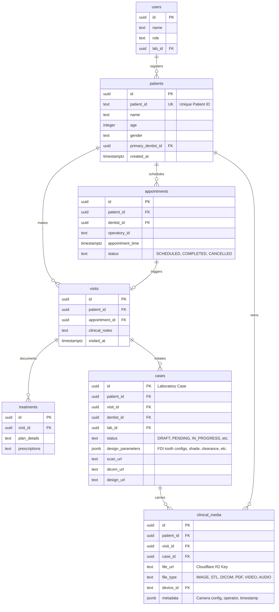
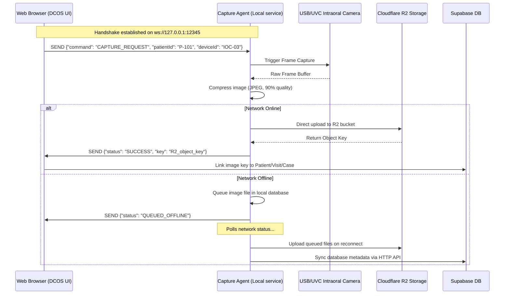
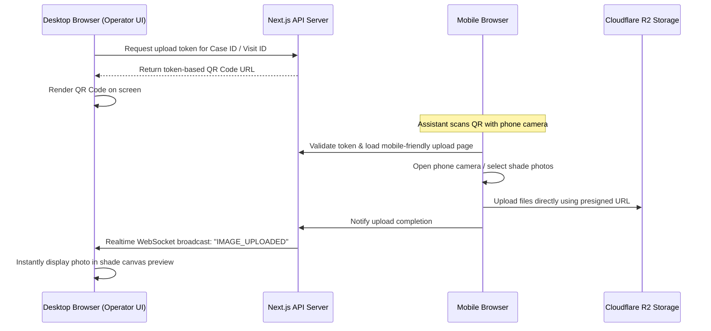

# DCOS 2.0: Comprehensive Feasibility Study & Cline Sprint Plan

This document maps the **DCOS 2.0 Product Requirements Document** to the existing **DentalConnect OS (DCOS)** implementation state, provides a robust technical feasibility analysis, and details an actionable sprint plan for **Cline** (our developer agent) to execute.

---

## 1. Comparative Analysis: Current vs. Required State

Below is a direct comparison of the requirements in the DCOS 2.0 PRD against what is already built in the DCOS codebase.

| Section | Feature / Requirement | Current DCOS Implementation State | Feasibility & Technical Gap |
| :--- | :--- | :--- | :--- |
| **8.1** | **Familiar Clinical Workflow** | We have a client-side case modal but **no separate schema** for patients, visits, appointments, or prescriptions. All patient data (`patient_name`, `patient_age`, `patient_gender`) is stored flat in the `cases` table. | **High Feasibility.** Needs a schema migration to break the flat table into a hierarchical model: `patients`, `appointments`, `visits`, `prescriptions`, `billing`. |
| **8.2** | **Clinical Media Hub** | File uploaders exist for STL, DICOM, and shade photos. Files upload to Cloudflare R2. However, there is **no unified Media Capture Hub** source picker interface. | **High Feasibility.** Build a unified React component `MediaCaptureHub` exposing options: Operatory Camera, Mobile Scan, DSLR, STL Import, DICOM, PDF. |
| **8.3** | **Multi-Camera Architecture** | No camera registration or metadata tracking exists. The system relies on generic browser file pickers. | **High Feasibility.** Create a `devices` table to map hardware identifiers (e.g. `IOC-01`, `CAMP-01`) to operatories. Tag uploads with `device_id` and session context. |
| **8.4** | **Capture Agent** | None. Browser uploads files directly from the local disk. | **Medium Feasibility.** Requires a local-running companion application (e.g. Go, Node, or Python) on the operatory PC communicating with the browser via a local WebSocket server (`ws://localhost:12345`). |
| **8.5** | **LabConnect Lifecycle** | A fully-functional Kanban board (`LabDashboard`) tracks case status changes. Real-time updates sync via Supabase Realtime websockets. | **Already Implemented.** The core digital lab workflow matches the PRD lifecycle. We need only to bind it to the new hierarchical patient timeline. |
| **8.6** | **Digital Dentistry Tools** | We have a functioning Three.js STL 3D viewer (`ThreeDViewer`). We store CBCT/DICOM files, but **lack a DICOM slice viewer** or design version history. | **High Feasibility.** Add a canvas-based 2D multi-planar reconstruction slice viewer for DICOM using cornerstone.js. Add a `design_versions` table for Exocad version history. |
| **8.8** | **Patient Portal** | None. Only Dentist and Lab dashboards exist. | **High Feasibility.** Implement a secure, token-authenticated `/patient` portal route utilizing dynamic magic links or mobile OTP login. |
| **8.9** | **AI Assistance (V1)** | None. | **High Feasibility.** Build Next.js API endpoints utilizing Gemini/OpenAI APIs for voice-to-text notes, clinical search, and automatic case verification warnings. |

---

## 2. Architecture & Data Flow Designs

### A. The Data Model Hierarchy
The PRD mandates a strict linking hierarchy to maintain medical data integrity:
`Patient ➔ Visit ➔ Treatment ➔ Tooth ➔ Laboratory Case`.

---

### B. Capture Agent Local Bridge Protocol
To avoid browser hardware permission limits and implement robust offline local queueing, a local executable (**Capture Agent**) communicates with the browser workspace via a local WebSocket connection:

---

### C. Mobile Phone (QR Code) Capture Intake Flow
The chairside assistant needs to quickly capture reference shade photographs on a smartphone and have them sync instantly to the desktop browser session:

---

## 4. Cline Actionable Sprint Roadmap

Cline will run the workspace tasks sequentially. This roadmap breaks down the exact directories, database migrations, and component refactoring needed to transition DCOS into the full DCOS 2.0 product.

### Phase 1: Database Restructuring & RLS Hardening
*Objective: Unify schemas, migrate profiles, create patient/visit hierarchy, and secure storage.*

*   **Task 1.1: Standardize Profiles/Users**
    *   Find all references to `public.profiles` in RLS policies and SQL migrations.
    *   Write a SQL migration to alter foreign keys to point to `public.users(id)`.
    *   Drop the duplicate `public.profiles` table.
*   **Task 1.2: Establish Patient & Visit Hierarchy**
    *   Create migrations for `patients`, `appointments`, `visits`, `treatments`, and `clinical_media`.
    *   Enable Row Level Security (RLS) on all new tables.
    *   Define dentist and lab access policies. Dentists see their own records, and labs see records associated with cases assigned to them.
*   **Task 1.3: Secure Cloudflare R2 Storage Bucket Policies**
    *   Ensure all public read policies are removed from storage.
    *   Configure presigned URLs for safe, authenticated client-side uploads.

---

### Phase 2: Refactoring Dentist Dashboard to Hierarchical Model
*Objective: Update case ingestion wizard to bind cases to registered patients and visits.*

*   **Task 2.1: Patient Intake & Selection Screen**
    *   Add a patient search/registration step to the beginning of the stepper wizard in [DentistDashboard.tsx](file:///c:/Users/bentn/OneDrive/Desktop/DEs/src/components/dashboards/DentistDashboard.tsx).
    *   Allow the assistant to select an existing patient (with auto-fill search) or register a new one.
*   **Task 2.2: Structured Design Parameters Column**
    *   Create a migration adding a `design_parameters` `JSONB` column to the `cases` table.
    *   Refactor the case submission payload to save the configurations directly to the `design_parameters` column rather than stringifying it into the text `instructions` box.

---

### Phase 3: Media Capture Hub & Local Capture Agent Interface
*Objective: Implement the unified media capture panel and WebSocket protocol.*

*   **Task 3.1: Unified Source Picker UI**
    *   Design the `MediaCaptureHub` modal inside `DentistDashboard.tsx`.
    *   Implement options for:
        1.  *Local Operatory Camera* (Triggers local Capture Agent WebSocket link)
        2.  *Mobile Device QR Capture* (Generates QR code with token redirecting to mobile page `/upload/mobile-[token]`)
        3.  *DSLR / Scanner File Uploads*
*   **Task 3.2: Local WebSocket Bridge Implementation**
    *   Write the browser-side WebSocket handler in React.
    *   On mounting the camera component, connect to `ws://localhost:12345`.
    *   Send and listen for events: `CAPTURE_REQUEST`, `CAMERA_STATUS`, `FRAME_DATA`, `CAPTURE_SUCCESS`.
    *   Write a reference mock Capture Agent script (e.g. `mock_capture_agent.py` in `agent_memory/scratch/`) that Cline and testing teams can run to simulate a hardware device connection.

---

### Phase 4: Digital Dentistry Enhancements & Patient Portal
*Objective: DICOM slice viewer, design version histories, and the client login route.*

*   **Task 4.1: Cornerstone DICOM Viewer**
    *   Integrate a basic 2D multi-planar slice viewer within the Case Details UI.
    *   Allow users to scroll through uploaded DICOM/CBCT scans.
*   **Task 4.2: Exocad Design Version History**
    *   Create a `case_designs` table tracking versions.
    *   Update [CaseDetailsClient.tsx](file:///c:/Users/bentn/OneDrive/Desktop/DEs/src/components/views/CaseDetailsClient.tsx) to list design files with technician upload timestamps and clinician approve/reject logs.
*   **Task 4.3: Secure Patient Portal**
    *   Create the `/patient` route.
    *   Implement a dashboard showing active appointments, billing details, fitted restoration types, and post-op care instructions.

---

## 4. Risks, Open Questions, & Architectural Decisions

> [!WARNING]
> **HIPAA & GDPR Compliance Alert:** Uploaded clinical images (DSLR photos, mobile photos, STL scans) contain Protected Health Information (PHI). We must enforce that all public URLs fetched via Cloudflare R2 use transient, signed, short-lived tokens (e.g., expiring in 15 minutes) rather than static, unauthenticated CDN paths.

> [!IMPORTANT]
> **Local WebSocket Sandbox Constraints:** Modern web browsers block attempts by HTTPS websites to connect to insecure WebSocket servers (`ws://`). To prevent mixed-content blocks, the local Capture Agent must bind to `127.0.0.1` (which browsers whitelist as secure local context) or provide a self-signed certificate supporting secure local loops (`wss://localhost`).
