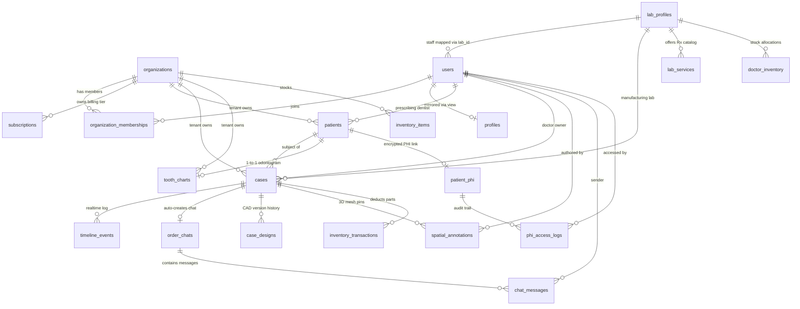
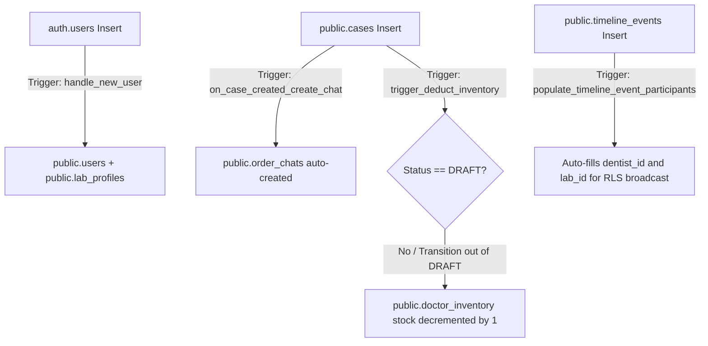

# DentalConnect OS (DCOS) 2.0: Master Backend System Map & Decision Engine

> **Canonical Backend Source of Truth**: This document maps the live PostgreSQL database schema on Supabase (`https://rrjjwerahglpsqxdpmkr.supabase.co`) to the exact components, services, and routes in the DentalConnect OS codebase.
> 
> **MANDATORY AGENT DIRECTIVE**: Before designing, approving, or deploying any new feature or schema migration, all developer agents (Antigravity, Claude Code, Cline) **MUST** consult this document and execute the **Feature Feasibility & Ripple-Effect Calculation Protocol** (Section 5).

---

## 1. High-Level Relational ERD Architecture

---

## 2. Complete Database Dictionary & Code-Binding Matrix

| # | Database Entity | Relational Keys | RLS Policy Scope | TypeScript Types | Services & API Routes | UI Components & Dashboards |
|---|---|---|---|---|---|---|
| **1** | **`public.users`** | `id UUID PK` (Auth user) `lab_id UUID FK $	o$ lab_profiles` | Users view self; Tenant members view team; Lab staff view assigned | `User` (`src/types.ts:5`) | `src/lib/data.ts:9` (`getCachedSession`) `src/lib/data.ts:25` (`getCachedUserProfile`) | `src/app/(dashboard)/page.tsx` `src/components/views/CaseDetailsClient.tsx` |
| **2** | **`public.profiles`** *(VIEW)* | `id UUID PK` over `users.id` | Evaluated via underlying `public.users` RLS | `User` (`src/types.ts:5`) | Transparent compatibility layer over `users` | Deprecated direct queries; queries routed to `users` |
| **3** | **`public.organizations`** | `id UUID PK` `slug TEXT UNIQUE` | Members view tenant; Owners/Admins update | `Organization` (`src/types.ts:210`) | `src/lib/subscriptions.ts` | Multi-tenant organization selector & clinic settings |
| **4** | **`public.organization_memberships`** | `organization_id UUID FK` `user_id UUID FK` | Members view co-workers | `OrganizationMembership` (`src/types.ts:225`) | Evaluated in `get_auth_organization_ids()` | Clinic team management & RBAC |
| **5** | **`public.subscriptions`** | `organization_id UUID FK (UNIQUE)` | Tenant members view subscription | `Subscription` (`src/types.ts:240`) | `src/lib/subscriptions.ts` (`getOrganizationSubscription`, `evaluateCaseQuota`) | `src/app/billing/page.tsx` `SubscriptionTierBadge` |
| **6** | **`public.patients`** | `id TEXT PK (DEFAULT gen_random_uuid())` `dentist_id UUID` `organization_id UUID FK` | Prescribing dentist + Tenant members + Assigned lab staff | `Patient` (`src/types.ts:45`) | `src/lib/services.ts` | `src/app/(dashboard)/patients/page.tsx` `src/components/dashboards/DentistDashboard.tsx#L1315` |
| **7** | **`public.patient_phi`** | `id UUID PK` `case_id UUID FK` `dentist_id UUID FK $	o$ users` | `FORCE RLS`: Strictly isolated to prescribing dentist | `PatientPhi` (`src/types.ts:270`) | Isolated encrypted vault | Encrypted patient demographic card |
| **8** | **`public.phi_access_logs`** | `id UUID PK` `patient_phi_id UUID FK` `accessed_by UUID FK $	o$ users` | `FORCE RLS`: Dentists view own access history | `PhiAccessLog` | Automated audit logger | Compliance / Medico-legal audit viewer |
| **9** | **`public.tooth_charts`** | `id UUID PK` `patient_id TEXT FK (UNIQUE)` `organization_id UUID FK` | Prescribing dentist + Tenant organization members | `ToothChartData` (`src/types.ts:101`) | `src/lib/services.ts` (`fetchPatientToothChart`, `savePatientToothChart`) | `src/components/patient-workspace/UnifiedClinicalWorkspace.tsx` `src/components/views/ClinicalVisitClient.tsx` |
| **10** | **`public.cases`** | `id UUID PK` `patient_id TEXT FK $	o$ patients` `dentist_id UUID FK $	o$ users` `lab_id UUID FK $	o$ lab_profiles` `organization_id UUID FK` | Doctor owner + Tenant members + Assigned lab staff | `Case` (`src/types.ts:15`) | `src/lib/data.ts:71` (`getCachedCases`) `src/app/api/upload/route.ts` | `src/app/(dashboard)/cases/page.tsx` `src/components/views/CaseDetailsClient.tsx` `src/components/dashboards/DentistDashboard.tsx` `src/components/dashboards/LabDashboard.tsx` |
| **11** | **`public.case_designs`** | `id UUID PK` `case_id UUID FK $	o$ cases` | Inherits parent case accessibility | `CaseDesign` | Technician design uploaders | `CaseDetailsClient.tsx` CAD/CAM version tab |
| **12** | **`public.spatial_annotations`** | `id UUID PK` `case_id UUID FK $	o$ cases` `author_id UUID FK $	o$ users` | Prescribing doctor + Assigned lab staff | `SpatialAnnotation` | Three.js 3D raycasting pins | `src/components/views/ThreeDViewer.tsx` |
| **13** | **`public.timeline_events`** | `id UUID PK` `case_id UUID FK $	o$ cases` `dentist_id UUID` `lab_id UUID` | Doctor owner + Assigned lab staff | `TimelineEvent` (`src/types.ts:60`) | Supabase Realtime websocket subscriptions | `src/components/views/CaseDetailsClient.tsx` activity feed |
| **14** | **`public.order_chats`** | `id UUID PK` `case_id UUID FK $	o$ cases` | Auto-created by DB trigger on case insert | `OrderChat` | Realtime channel subscriber | `CaseDetailsClient.tsx` chat drawer |
| **15** | **`public.chat_messages`** | `id UUID PK` `chat_id UUID FK $	o$ order_chats` `sender_id UUID FK $	o$ users` | Chat participants (doctor & lab staff) | `ChatMessage` (`src/types.ts:75`) | Realtime message broadcast | `CaseDetailsClient.tsx` chat feed |
| **16** | **`public.lab_profiles`** | `id UUID PK` | Public read for authenticated dentists | `LabProfile` (`src/types.ts:85`) | `src/lib/services.ts` | `src/app/labs/page.tsx` `src/app/lab-directory/page.tsx` |
| **17** | **`public.lab_services`** | `id UUID PK` `lab_id UUID FK $	o$ lab_profiles` | Active catalog is publicly readable | `LabService` (`src/lib/services.ts:23`) | `src/lib/services.ts` (`fetchLabServices`) | `src/app/labs/page.tsx` catalog accordion |
| **18** | **`public.doctor_inventory`** | `id UUID PK` `dentist_id UUID FK $	o$ users` `lab_id UUID FK $	o$ lab_profiles` | Owning dentist only | `DoctorInventory` | `src/components/dashboards/DentistInventoryClient.tsx` | Pre-paid crown & bridge balance trackers |
| **19** | **`public.inventory_items`** | `id UUID PK` `lab_id UUID FK $	o$ lab_profiles` `organization_id UUID FK` | Lab staff & Tenant owners | `InventoryItem` (`src/types.ts:130`) | `src/app/inventory/page.tsx` | `src/components/dashboards/InventoryDashboard.tsx` |
| **20** | **`public.inventory_transactions`** | `id UUID PK` `inventory_id UUID FK` `case_id UUID FK` | Lab staff & Tenant owners | `InventoryTransaction` | Physical consumable ledger | Lab materials traceability |
| **21** | **`public.domain_events`** | `id UUID PK` (Bi-temporal append-only ledger) | Enterprise audit administrators | `DomainEvent` | `src/lib/events/event-store.ts` | Cryptographic tamper-evident Merkle ledger |

---

## 3. Database Orchestration Triggers & Side-Effects

---

## 4. Storage & Media Asset Topology (Cloudflare R2)

All binary medical assets (STL meshes, DICOM volumes, DSLR shade photos, and Exocad CAD designs) are stored outside Postgres in Cloudflare R2:

| Storage Asset | R2 Bucket & Path Structure | Client Resolution | Security Model |
|---|---|---|---|
| **3D STL Scans** | `dcos-scans/scans/<caseId>/<fileName>.stl` | `getR2PublicUrl(key)` | Presigned S3 PUT via `/api/upload` |
| **CBCT DICOM Volumes** | `dcos-scans/dicom/<caseId>/<fileName>.dcm` | `getR2PublicUrl(key)` | Presigned S3 PUT via `/api/upload` |
| **Shade Photos** | `dcos-scans/shade/<patientId>/<fileName>.jpg` | `getR2PublicUrl(key)` | Presigned S3 PUT via `/api/upload` |
| **Soft-Copy Designs** | `dcos-scans/designs/<caseId>/<fileName>.stl` | `getR2PublicUrl(key)` | Technician authenticated upload |

---

## 5. Agent Feature Feasibility & Ripple-Effect Calculation Engine

Whenever an agent or developer proposes adding, refactoring, or deploying a feature, execute this **4-Step Evaluation Matrix**:

### Step 1: Feasibility Analysis (The 5 Core Checks)
1. **Schema Check:** Does the target table exist in Section 2, or does it require a tracked SQL migration?
2. **Type Harmony:** Does the primary key / foreign key match (`TEXT` vs `UUID`)?
3. **RLS Blast Radius:** Does the new query access rows via `auth.uid()` or `get_auth_organization_ids()`?
4. **Trigger Interception:** Does the mutation hit `cases`, `users`, or `timeline_events` and fire background triggers?
5. **Ghost Code Filter:** Does the feature rely on unwired subsystems (`lib/events`, `lib/abdm`, `lib/agents`)? If yes, hard-gate until wired.

### Step 2: Ripple-Effect Permutation Calculator

| If You Are Modifying… | You MUST Cross-Check These Dependencies: |
|---|---|
| **Patient Registration / Intake** | 1. `patients.id` must use `DEFAULT gen_random_uuid()::text` if omitted. 2. `tooth_charts` 1-to-1 sync. 3. `patient_phi` dentist isolation. 4. `cases.patient_id` foreign key. |
| **Case Creation / Status Machine** | 1. Trigger `on_case_created_create_chat` auto-provisions chat. 2. Trigger `trigger_deduct_inventory` decrements `doctor_inventory` when leaving `DRAFT`. 3. RLS policy for `cases` evaluates both `organization_id` and `users.lab_id`. |
| **Lab Directory & Services** | 1. `lab_services.lab_id` references `public.lab_profiles(id)`, NOT `users(id)`. 2. Query `lab_profiles` with relational `lab_services(*)`. |
| **Tooth Chart (Odontogram)** | 1. Writes must persist to `public.tooth_charts` via `savePatientToothChart`. 2. Reads must call `fetchPatientToothChart` for cloud multi-device sync with fallback to `getPatientToothChart`. |
| **User Signups / Identity** | 1. `public.users` is canonical. 2. `public.profiles` is a read-only compatibility view. Never insert into `profiles`. |

### Step 3: Deployment & Verification Protocol
1. **Migration Verification:** Execute DDL via Supabase MCP `apply_migration` (never run unreviewed manual ALTERs).
2. **Catalog Verification:** Inspect `information_schema` and `pg_constraint` via `execute_sql`.
3. **Master Suite Test:** Run `npx tsx scripts/verify-backend-master.ts` (must pass 33/33 tests).
4. **Build Verification:** Run `npm run build` (must yield 0 errors across 21 routes).
5. **Parallel Documentation:** Update `session_handoff.md`, `changelog.md`, `antigravity_inbox.md`, and relevant ICM cards.
