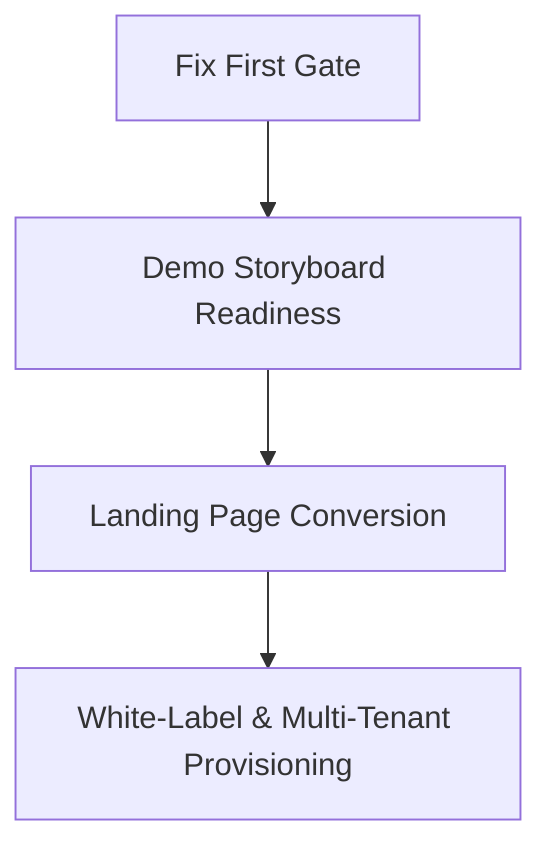

# DCOS Development Tasks Scoped from Sales Action Plan

> Related: [[AGENTS]] · [[CLAUDE]] · [[design]] · [[codebase_audit]] · [[recent_enhancements]] · `sales_ops/00_README.md`

This document translates the **DCOS Sales Ops Execution Packet** (`sales_ops/`) and **Buyer Playbook v3** into concrete, prioritized engineering work packages.

---

## 🎯 Executive Overview & Target Milestones

- **Sales Objective**: Close 1st India reference customer ($5–8k Starter tier) in 3–5 weeks; close 1st Western perpetual license ($10–15k Standard tier) in 8–12 weeks.
- **Critical Gate**: Complete the **Fix First Gate** before outbound outreach begins so enterprise buyers and technical evaluators encounter zero security or data-isolation objections during discovery calls.

---

## 📋 Scoped Development Work Packages

---

### Phase 1: The "Fix First" Security & Integrity Gate
*Non-negotiable security requirements before running live prospect demos and Western outreach.*

| Task ID | Task Description | Target File(s) | Status |
|---|---|---|---|
| **SEC-01** | Replace direct client-side inventory writes in `DentistInventoryClient.tsx` with authenticated Server Actions (`purchaseDoctorInventoryAction`). | [`src/components/views/DentistInventoryClient.tsx`](file:///c:/Users/bentn/OneDrive/Desktop/DEs/src/components/views/DentistInventoryClient.tsx), `src/actions/inventory.ts` | 🟡 Ready for Execution |
| **SEC-02** | Verify zero `getSession()` calls across all server/API routes in favor of cryptographically verified `getUser()`. | `src/lib/data.ts`, `src/app/api/` | 🟢 Completed |
| **SEC-03** | Ensure all patient scan bucket access is routed through authenticated `/api/files/[...key]` streaming handlers with CORS headers. | [`src/app/api/files/[...key]/route.ts`](file:///c:/Users/bentn/OneDrive/Desktop/DEs/src/app/api/files/[...key]/route.ts), [`src/lib/r2.ts`](file:///c:/Users/bentn/OneDrive/Desktop/DEs/src/lib/r2.ts) | 🟢 Completed |
| **SEC-04** | Enforce strict clinical data isolation: lab workstation views tokenized case manufacturing parameters with zero access to patient PII/clinical history. | [`src/components/lab/LabWorkstationStudio.tsx`](file:///c:/Users/bentn/OneDrive/Desktop/DEs/src/components/lab/LabWorkstationStudio.tsx) | 🟢 Completed |

---

### Phase 2: The 90-Second Loom & 10-Minute Live Demo Suite
*Engineered specifically to support the 5 core beats of the demo storyboard ([`sales_ops/04_Demo_Storyboard.md`](file:///c:/Users/bentn/OneDrive/Desktop/DEs/sales_ops/04_Demo_Storyboard.md)).*

| Task ID | Task Description | Target File(s) | Impact / Demo Beat |
|---|---|---|---|
| **DEMO-01** | **Seed Data Automation Script**: Automated CLI script (`scripts/seed-demo-lab.ts`) provisioning clean demo accounts (*"Precision Dental Lab"*, *"Dr. Alex Morgan"*, sample molar STL scans). | `scripts/seed-demo-lab.ts` | Beat 1: Frictionless case intake setup |
| **DEMO-02** | **Automated Inventory Deduction Toast**: Trigger real-time inventory deduction (`"Deducted 1 unit of Zirconia Block"`) upon dragging a card into production on `LabDashboard`. | [`src/components/dashboards/LabDashboard.tsx`](file:///c:/Users/bentn/OneDrive/Desktop/DEs/src/components/dashboards/LabDashboard.tsx) | Beat 2: Automated lab inventory sync |
| **DEMO-03** | **Interactive 3D Spatial Pin Polish**: Enhance pin drop on STL mesh with instant coordinate anchoring, model rotation tracking, and live toast notification to the clinic. | [`src/components/ThreeDViewerInner.tsx`](file:///c:/Users/bentn/OneDrive/Desktop/DEs/src/components/ThreeDViewerInner.tsx) | Beat 3: The 3D closing moment |
| **DEMO-04** | **Per-Case Chat Gating & Realtime Unlock**: Chat unlocks automatically when case status changes to `IN_PRODUCTION`, appending events to the case audit timeline. | [`src/components/lab/LabWorkstationStudio.tsx`](file:///c:/Users/bentn/OneDrive/Desktop/DEs/src/components/lab/LabWorkstationStudio.tsx) | Beat 4: Integrated case communication |
| **DEMO-05** | **Live Prospect White-Label Switcher**: Add a discreet prospect branding bar allowing the sales presenter to switch the primary theme color (`--primary`) and lab logo live during calls. | `src/components/demo/WhiteLabelSwitcher.tsx` | Beat 5: Live white-label showcase |

---

### Phase 3: High-Converting Inbound Landing Page
*Aligning `dcos.in` with the high-conversion copy in [`sales_ops/10_Landing_Page_Copy.md`](file:///c:/Users/bentn/OneDrive/Desktop/DEs/sales_ops/10_Landing_Page_Copy.md).*

| Task ID | Task Description | Target File(s) | Status |
|---|---|---|---|
| **LAND-01** | **Hero & Trust Bar Overhaul**: Implement copy *"The portal your dental lab needs. Owned by you, not rented from Dandy"* with dual CTA (`Book a 30-min demo`, `See 90-sec walkthrough`). | [`src/components/landing/LandingPage.tsx`](file:///c:/Users/bentn/OneDrive/Desktop/DEs/src/components/landing/LandingPage.tsx) | 🟡 Ready for Alignment |
| **LAND-02** | **Two-Column Problem vs Solution Grid**: Side-by-side comparison of manual lab operations (WhatsApp/PDFs) vs DCOS automated pipeline. | [`src/components/landing/LandingPage.tsx`](file:///c:/Users/bentn/OneDrive/Desktop/DEs/src/components/landing/LandingPage.tsx) | 🟡 Ready for Alignment |
| **LAND-03** | **Interactive 3-Panel Product Tour**: Interactive tabs demonstrating Kanban auto-deduct, 3D Spatial Pins, and Real-time Operatory Chat. | [`src/components/landing/LandingPage.tsx`](file:///c:/Users/bentn/OneDrive/Desktop/DEs/src/components/landing/LandingPage.tsx) | 🟡 Ready for Alignment |
| **LAND-04** | **Perpetual License Pricing Matrix**: Display Starter ($6,000), Standard ($12,000), and Enterprise ($25,000) one-time buyout tiers with source code deliverables. | [`src/components/landing/LandingPage.tsx`](file:///c:/Users/bentn/OneDrive/Desktop/DEs/src/components/landing/LandingPage.tsx) | 🟡 Ready for Alignment |

---

### Phase 4: Buyer SOW & Enterprise Deployment Automation
*Supporting the deliverables promised in [`sales_ops/06_Proposal_SOW_Template.md`](file:///c:/Users/bentn/OneDrive/Desktop/DEs/sales_ops/06_Proposal_SOW_Template.md).*

| Task ID | Task Description | Target File(s) | Status |
|---|---|---|---|
| **OPS-01** | **One-Click Deploy Script**: Containerized self-hosted deployment bundle (`docker-compose.yml` / Supabase CLI self-hosted config) for buyer infrastructure. | `deploy/docker-compose.yml`, `docs/DEPLOYMENT_GUIDE.md` | 🟡 Scoped |
| **OPS-02** | **Bi-Temporal Audit Ledger Export**: PDF/CSV export of case compliance logs for lab quality certifications (ISO 13485 / MDR). | [`src/components/lab/LabWorkstationStudio.tsx`](file:///c:/Users/bentn/OneDrive/Desktop/DEs/src/components/lab/LabWorkstationStudio.tsx) | 🟡 Scoped |

---

## 🚀 Execution Priority Matrix

1. **Immediate (Next 48 Hours)**:
   - Close **SEC-01** (Server action for inventory writes).
   - Build **DEMO-01** (Demo seed script) & **DEMO-05** (White-label switcher).
2. **Short-Term (Days 3–5)**:
   - Align Landing Page (**LAND-01** through **LAND-04**) for inbound lead capture.
   - Record 90-sec Loom demo asset.
3. **Mid-Term (Days 6–14)**:
   - Run India Tier A outbound and support live discovery calls with the demo suite.
